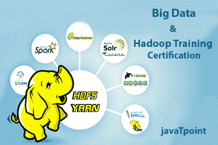

# Hadoop 教程

> 原文：<https://www.javatpoint.com/hadoop-tutorial>

Hadoop 教程提供了 Hadoop 的基本概念和高级概念。我们的 Hadoop 教程是为初学者和专业人士设计的。

Hadoop 是一个开源框架。它由 Apache 提供，用于处理和分析非常庞大的数据量。它是用 Java 写的，目前被谷歌、脸书、领英、雅虎、推特等使用。

我们的 Hadoop 教程包括大数据 Hadoop 与 HDFS、MapReduce、Shate、Hive、HBase、Pig、Sqoop 等的所有主题。

* * *

## Hadoop 索引

* * *

**Hadoop 教程**

*   [Hadoop 教程](hadoop-tutorial)
*   [什么是大数据](what-is-big-data)
*   [什么是 Hadoop](what-is-hadoop)
*   [Hadoop 安装](hadoop-installation)

**Hadoop 模块**

*   [HDFS](hdfs)
*   [纱线](yarn)
*   [MapReduce](mapreduce)

hbase

*   hbase 教程
*   [什么是 HBase](what-is-hbase)
*   [HBase 模型](hbase-data-model)
*   [HBase 阅读](hbase-read)
*   [HBase 书写](hbase-write)
*   [hbas memstore](hbase-memstore)
*   hbase 安装
*   [RDBMS 诉 HBase](rdbms-vs-hbase)
*   [糖化指令](hbase-commands)
*   [HBase 示例](hbase-example)

**鼠标**

*   [Hive 教程](hive)
*   [什么是 Hive](what-is-hive)
*   [蜂箱安装](hive-installation)
*   [Hive 数据类型](hive-data-types)
*   [Hive 划分](hive-table-partitioning)
*   [Hive 命令](hive-commands)
*   [Hive 分布式拒绝服务命令](hive-ddl-commands)
*   [Hive DML 命令](hive-dml-commands)
*   [蜂箱排序依据](hive-sort-by-order-by)
*   [Hive 连接](hive-join)

**PIG**

*   [PIG 教程](pig)
*   [什么是 PIG](what-is-pig)
*   [清管器安装](pig-installation)
*   [清管器运行模式](pig-run-modes)
*   [PIG 拉丁概念](pig-latin-concepts)
*   [PIG 数据类型](pig-data-types)
*   [PIG 例](pig-example)
*   [Pig UDF](pig-udf)

**sqoops**

*   [Sqoop 教程](sqoop)
*   [什么是 Sqoop](what-is-sqoop)
*   [Sqoop 安装](sqoop-installation)
*   [启动程序](starting-sqoop)
*   [Sqoop 导入](sqoop-import)
*   [方块](sqoop-where)
*   [Sqoop 出口](sqoop-export)
*   [与 Hadoop 生态系统的 Sqoop 集成](sqoop-integration-with-hadoop-ecosystem)

**面试问题**

*   [Hadoop 访谈](hadoop-interview-questions)

* * *

## 先决条件

在学习 Hadoop 之前，你必须具备 java 编程语言的基础知识。

## 观众

我们的 Hadoop 教程旨在帮助初学者和专业人士。

## 问题

我们保证您在本 Hadoop 教程中不会发现任何问题。但是如果有任何错误，请在联系表格中发布问题。