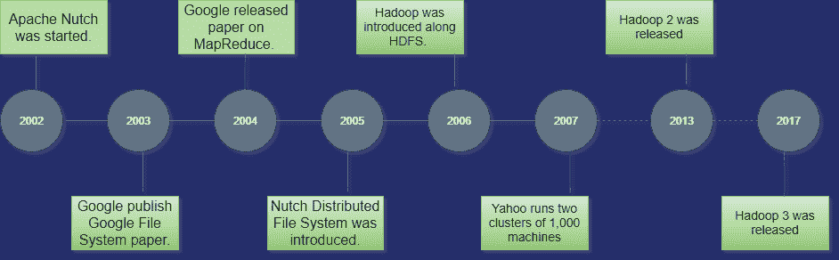

# 什么是 Hadoop

> 原文：<https://www.javatpoint.com/what-is-hadoop>

Hadoop 是来自 Apache 的开源框架，用于存储、处理和分析海量数据。Hadoop 是用 Java 编写的，不是 OLAP(在线分析处理)。用于批量/离线处理。脸书、雅虎、谷歌、推特、领英和许多其他公司都在使用它。此外，只需在集群中添加节点，就可以扩大规模。

## Hadoop 的模块

1.  **HDFS:** Hadoop 分布式文件系统。谷歌发表了它的论文 GFS，并在此基础上开发了 HDFS。它声明文件将被分成块并存储在分布式体系结构的节点中。
2.  **纱线:**另一个资源协商器用于作业调度和管理集群。
3.  **Map Reduce:** 这是一个帮助 Java 程序使用键值对进行数据并行计算的框架。映射任务获取输入数据，并将其转换为可在键值对中计算的数据集。地图任务的输出被归约任务消耗，归约任务的输出给出期望的结果。
4.  **Hadoop Common:** 这些 Java 库用于启动 Hadoop，并被其他 Hadoop 模块使用。

## Hadoop 架构

Hadoop 架构是文件系统、MapReduce 引擎和 HDFS (Hadoop 分布式文件系统)的包。MapReduce 引擎可以是 MapReduce/MR1 或纱/MR2。

Hadoop 集群由单个主节点和多个从节点组成。主节点包括作业跟踪器、任务跟踪器、名称节点和数据节点，而从节点包括数据节点和任务跟踪器。

## Hadoop 分布式文件系统

Hadoop 分布式文件系统(HDFS)是一个面向 Hadoop 的分布式文件系统。它包含一个主/从架构。这种体系结构由单个名称节点和多个数据节点组成，前者充当主节点，后者充当从节点。

名称节点和数据节点都足以在商用机器上运行。Java 语言被用来开发 HDFS。所以任何支持 Java 语言的机器都可以轻松运行 NameNode 和 DataNode 软件。

### 名称节点

*   它是 HDFS 集群中的单个主服务器。
*   由于是单个节点，可能会成为单点故障的原因。
*   它通过执行像打开、重命名和关闭文件这样的操作来管理文件系统命名空间。
*   它简化了系统的架构。

### 数据节点

*   HDFS 群集包含多个数据节点。
*   每个数据节点包含多个数据块。
*   这些数据块用于存储数据。
*   数据节点负责从文件系统的客户端读取和写入请求。
*   它根据名称节点的指令执行数据块创建、删除和复制。

### 工作跟踪器

*   作业跟踪器的作用是从客户端接受MapReduce作业，并使用名称节点处理数据。
*   作为响应，名称节点向作业跟踪器提供元数据。

### 任务跟踪器

*   它充当作业跟踪器的从节点。
*   它从作业跟踪器接收任务和代码，并将这些代码应用到文件中。这个过程也可以称为映射器。

## MapReduce图层

当客户端应用程序将MapReduce作业提交给作业跟踪器时，MapReduce就存在了。作为响应，作业跟踪器将请求发送给适当的任务跟踪器。有时，任务跟踪器会失败或超时。在这种情况下，作业的该部分将被重新安排。

## Hadoop 的优势

*   **快速:**在 HDFS，数据分布在集群中并被映射，这有助于更快的检索。甚至处理数据的工具也经常在同一个服务器上，从而减少了处理时间。它能够在几分钟内处理万亿字节的数据，在几小时内处理几十亿字节的数据。
*   **可扩展:**只需在集群中添加节点，即可扩展 Hadoop 集群。
*   **性价比:** Hadoop 是开源的，使用商品硬件来存储数据，所以和传统的关系型数据库管理系统相比，确实很划算。
*   **故障恢复能力:** HDFS 具有通过网络复制数据的特性，因此如果一个节点发生故障或其他网络故障，那么 Hadoop 会获取另一份数据并使用它。通常，数据被复制三次，但复制因子是可配置的。

## Hadoop 的历史

Hadoop 由道格·卡特和迈克·卡法雷拉于 2002 年发起。它的起源是谷歌发表的谷歌文件系统论文。

让我们通过以下步骤来关注 Hadoop 的历史

*   2002 年，道格·卡特和迈克·卡法雷拉开始着手一个项目，Apache·努奇。是一个开源的网络爬虫软件项目。
*   在 Apache Nutch 上工作时，他们正在处理大数据。为了存储这些数据，他们不得不花费大量的成本，这也是该项目的结果。这个问题成为 Hadoop 出现的重要原因之一。
*   2003 年，谷歌推出了一个名为 GFS(谷歌文件系统)的文件系统。它是一个专有的分布式文件系统，旨在提供高效的数据访问。
*   2004 年，谷歌发布了一份关于MapReduce的白皮书。这项技术简化了大型集群上的数据处理。
*   2005 年，道格·卡特和迈克·卡法雷拉引入了一种新的文件系统，称为 NDFS (Nutch 分布式文件系统)。该文件系统还包括MapReduce。
*   2006 年，Doug Cutting 退出谷歌，加入雅虎。在 Nutch 项目的基础上，面团切割引入了一个新项目 Hadoop，其文件系统被称为 HDFS (Hadoop 分布式文件系统)。今年发布的 Hadoop 第一版 0.1.0。
*   道格·凯丁以他儿子的玩具大象命名了他的项目 Hadoop。
*   2007 年，雅虎运营着两个 1000 台机器的集群。
*   2008 年，Hadoop 成为在 209 秒内对 900 节点集群上的 1tb 数据进行排序的最快系统。
*   2013 年，Hadoop 2.2 发布。
*   2017 年，Hadoop 3.0 发布。

| 年 | 事件 |
| Two thousand and three | 谷歌发布了论文《谷歌文件系统》。 |
| Two thousand and four | 谷歌发布了一份关于MapReduce的白皮书。 |
| Two thousand and six | 

*   大数据介绍。
*   Hadoop 0.1.0 发布。
*   Yahoo deployed 300 machines, reaching 600 this year.

 |
| Two thousand and seven | 

*   Yahoo runs two clusters of 1000 machines.
*   Hadoop 包括 HBase。

 |
| Two thousand and eight | 

*   Yarn JIRA open
*   Hadoop becomes the fastest system to sort 1tb data on 900-node cluster in 209 seconds.
*   Yahoo cluster loads 10tb every day.
*   Cloudera was founded as a Hadoop distributor.

 |
| Two thousand and nine | 

*   Yahoo operates 17 clusters with 24,000 machines.
*   Hadoop is powerful enough to sort gigabytes.
*   MapReduce and HDFS become separate subprojects.

 |
| Two thousand and ten | 

*   Hadoop has added support for Kerberos.
*   Hadoop runs 4000 nodes, 40pb.
*   Archie's hive and piglet release.

 |
| Two thousand and eleven | 

*   Released by Archie city zoo.
*   Yahoo has 42,000 Hadoop nodes and hundreds of gigabytes of storage space.

 |
| Two thousand and twelve | Apache Hadoop 1.0 版本发布。 |
| Two thousand and thirteen | Apache Hadoop 2.2 版本发布。 |
| Two thousand and fourteen | Apache Hadoop 2.6 版本发布。 |
| Two thousand and fifteen | Apache Hadoop 2.7 版本发布。 |
| Two thousand and seventeen | Apache Hadoop 3.0 版本发布。 |
| Two thousand and eighteen | Apache Hadoop 3.1 版本发布。 |