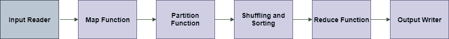

# MapReduce 中的数据流

> 原文：<https://www.javatpoint.com/data-flow-in-mapreduce>

MapReduce 用于计算海量数据。为了以并行和分布式的形式处理即将到来的数据，数据必须从各个阶段流出。

## MapReduce 数据流的各个阶段

### 输入阅读器

输入读取器读取即将到来的数据，并将其分割成适当大小的数据块(64 MB 到 128 MB)。每个数据块与一个映射函数相关联。

一旦输入读取了数据，就会生成相应的键值对。输入文件位于 HDFS。

#### 注意-输入数据可以是任何形式。

### 地图功能

map 函数处理即将到来的键值对，并生成相应的输出键值对。地图输入和输出类型可能互不相同。

### 分区函数

分区函数将每个映射函数的输出分配给适当的缩减器。可用的键和值提供了此功能。它返回减号的索引。

### 洗牌和排序

数据在节点之间/节点内被打乱，以便从地图中移出，并准备好处理缩减功能。有时，数据的洗牌会花费很多计算时间。

对减少功能的输入数据执行排序操作。这里，数据使用比较函数进行比较，并以排序的形式排列。

### 缩减功能

“减少”功能分配给每个唯一的键。这些键已经按排序顺序排列好了。与键相关联的值可以迭代 Reduce 并生成相应的输出。

### 输出写入器

一旦数据从上述所有阶段流出，输出编写器就执行。输出写入器的作用是将缩减输出写入稳定存储。