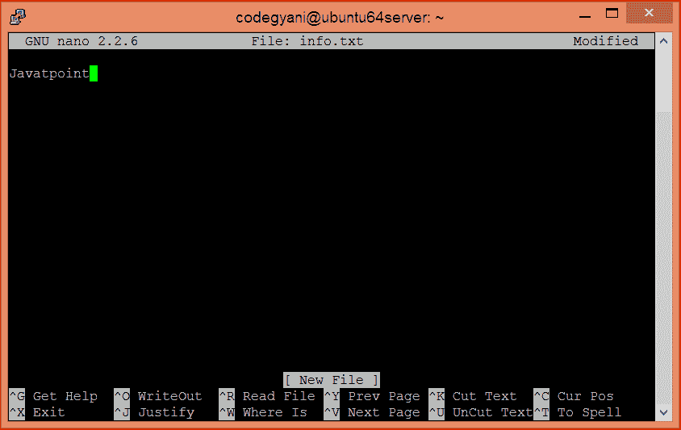
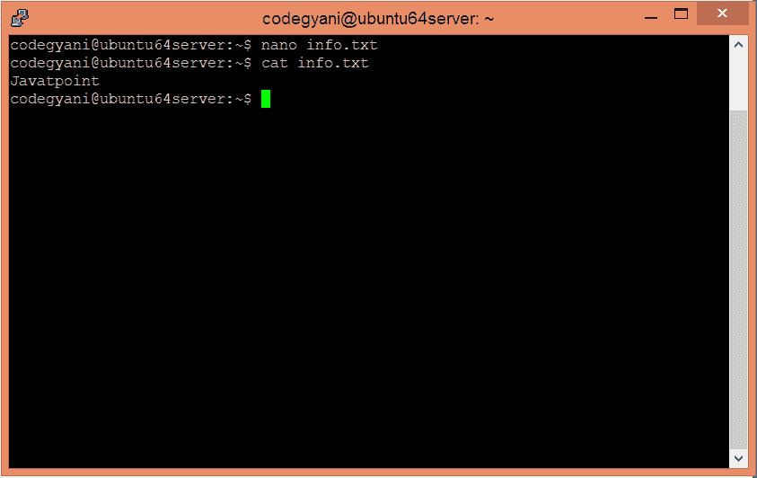
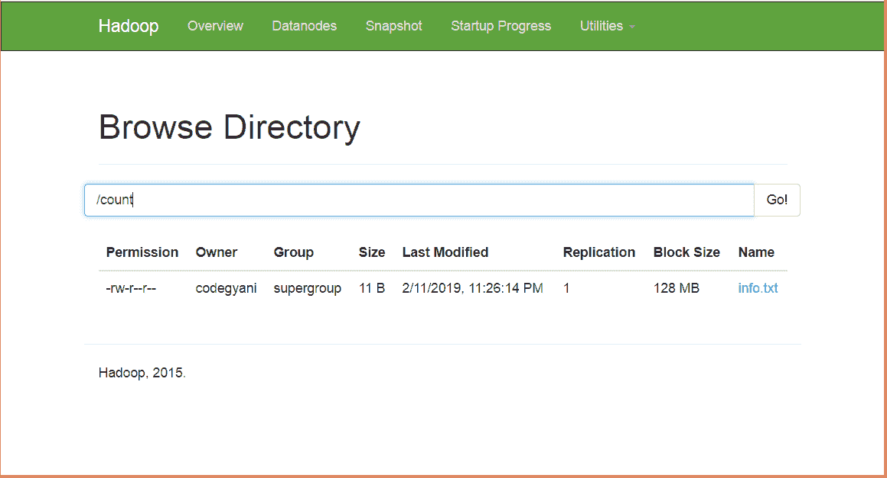
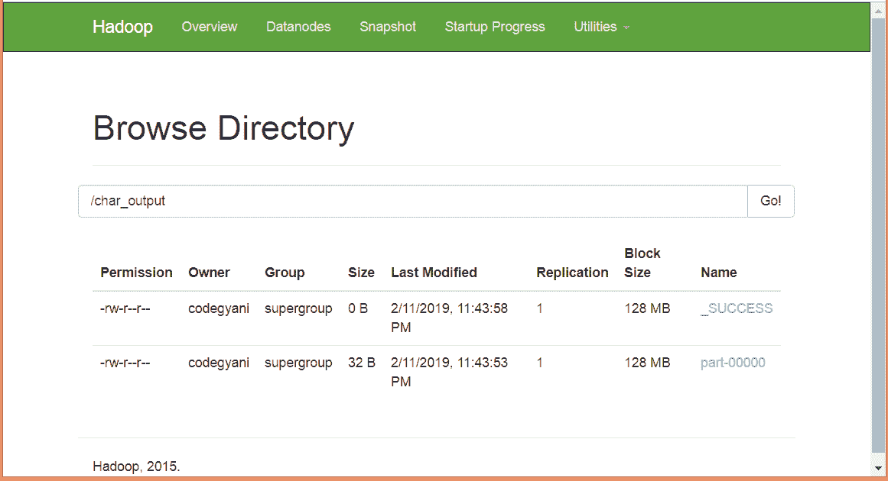
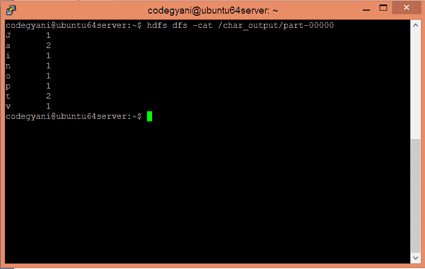

# MapReduce字符数示例

> 原文：<https://www.javatpoint.com/mapreduce-char-count-example>

在 MapReduce 字符计数示例中，我们找出了每个字符的频率。在这里，Mapper 的作用是将键映射到现有值，Reducer 的作用是聚合公共值的键。所以，一切都以键值对的形式来表示。

## 先决条件

*   **Java 安装-** 使用以下命令检查是否安装了 Java。
    java 版
*   **Hadoop 安装-** 使用以下命令检查是否安装了 Hadoop。
    hadoop 版本

如果您的系统中没有安装其中任何一个，请按照下面的链接进行安装。

[www.javatpoint.com/hadoop-installation](https://www.javatpoint.com/hadoop-installation)

## 执行 MapReduce 字符计数示例的步骤

*   在本地机器上创建一个文本文件，并在其中写入一些文本。
    $ nano info.txt



*   检查 info.txt 文件中写入的文本。
    $ cat info.txt



在这个例子中，我们发现每个字符值在这个文本文件中存在的频率。

*   在 HDFS 创建一个目录，在那里保存文本文件。
    $ hdfs dfs -mkdir /count
*   将 HDFS 的 info.txt 文件上传到特定目录。
    $ HDFS DFS-put/home/codegyani/info . txt/count



*   使用 eclipse 编写 MapReduce 程序。

### 文件:WC_Mapper.java

```

package com.javatpoint;

import java.io.IOException;    
import org.apache.hadoop.io.IntWritable;  
import org.apache.hadoop.io.LongWritable;  
import org.apache.hadoop.io.Text;  
import org.apache.hadoop.mapred.MapReduceBase;  
import org.apache.hadoop.mapred.Mapper;  
import org.apache.hadoop.mapred.OutputCollector;  
import org.apache.hadoop.mapred.Reporter;  
public class WC_Mapper extends MapReduceBase implements Mapper<LongWritable,Text,Text,IntWritable>{  
    public void map(LongWritable key, Text value,OutputCollector<Text,IntWritable> output,   
           Reporter reporter) throws IOException{  
        String line = value.toString();  
        String  tokenizer[] = line.split("");  
        for(String SingleChar : tokenizer)
		{
			Text charKey = new Text(SingleChar);
			IntWritable One = new IntWritable(1);
			output.collect(charKey, One);				
		}
    }  

} 

```

### 文件:WC_Reducer.java

```

package com.javatpoint;
	import java.io.IOException;  
	import java.util.Iterator;  
	import org.apache.hadoop.io.IntWritable;  
	import org.apache.hadoop.io.Text;  
	import org.apache.hadoop.mapred.MapReduceBase;  
	import org.apache.hadoop.mapred.OutputCollector;  
	import org.apache.hadoop.mapred.Reducer;  
	import org.apache.hadoop.mapred.Reporter;  

	public class WC_Reducer  extends MapReduceBase implements Reducer<Text,IntWritable,Text,IntWritable> {  
	public void reduce(Text key, Iterator<IntWritable> values,OutputCollector<Text,IntWritable> output,  
	 Reporter reporter) throws IOException {  
	int sum=0;  
	while (values.hasNext()) {  
	sum+=values.next().get();  
	}  
	output.collect(key,new IntWritable(sum));  
	}  
	}

```

### 文件:WC_Runner.java

```

package com.javatpoint;

	import java.io.IOException;  
	import org.apache.hadoop.fs.Path;  
	import org.apache.hadoop.io.IntWritable;  
	import org.apache.hadoop.io.Text;  
	import org.apache.hadoop.mapred.FileInputFormat;  
	import org.apache.hadoop.mapred.FileOutputFormat;  
	import org.apache.hadoop.mapred.JobClient;  
	import org.apache.hadoop.mapred.JobConf;  
	import org.apache.hadoop.mapred.TextInputFormat;  
	import org.apache.hadoop.mapred.TextOutputFormat;  
	public class WC_Runner {  
	    public static void main(String[] args) throws IOException{  
	        JobConf conf = new JobConf(WC_Runner.class);  
	        conf.setJobName("CharCount");  
	        conf.setOutputKeyClass(Text.class);  
	        conf.setOutputValueClass(IntWritable.class);          
	        conf.setMapperClass(WC_Mapper.class);  
	        conf.setCombinerClass(WC_Reducer.class);  
	        conf.setReducerClass(WC_Reducer.class);       
	        conf.setInputFormat(TextInputFormat.class);  
	        conf.setOutputFormat(TextOutputFormat.class);         
	        FileInputFormat.setInputPaths(conf,new Path(args[0]));  
	        FileOutputFormat.setOutputPath(conf,new Path(args[1]));   
	        JobClient.runJob(conf);  
	    }  
	}  

```

### 下载源代码。

*   创建这个程序的 jar 文件并命名为**charcoundemo . jar .**
*   运行 jar 文件
    Hadoop jar/home/codegyani/charcoundemo . jar . com . javatpoint . WC _ Runner/count/info . txt/char _ output
*   输出存储在/char_output/part-00000 中



*   现在执行命令查看输出。
    HDFS DFS-cat/r _ output/part-00000

