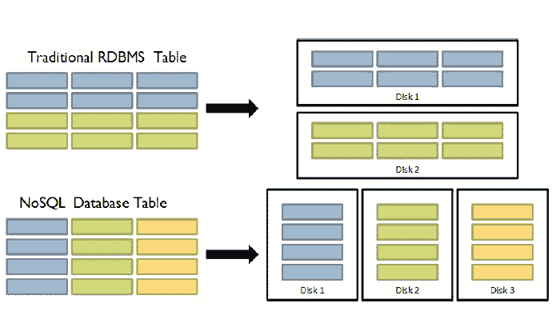

# RDBMS vs HBase

> 哎哎哎:# t0]https://www . javatppoint . com/RDBMS-vs-hbase

关系数据库管理系统和糖化血红蛋白酶之间的区别如下。

*   关系数据库管理系统中的模式/数据库可以与 Hbase 中的命名空间进行比较。
*   RDBMS 中的表可以与 Hbase 中的列族进行比较。
*   RDBMS 中的记录(在表连接之后)可以与 Hbase 中的记录进行比较。
*   RDBMS 中的表集合可以与 Hbase 中的表进行比较..

