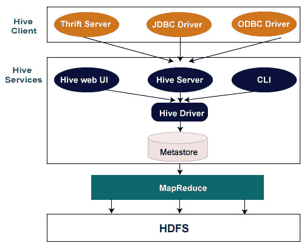

# Hive建筑

> 原文：<https://www.javatpoint.com/hive-architecture>

下面的架构解释了向 Hive 提交查询的流程。

## Hive客户端

Hive 允许用各种语言编写应用程序，包括 Java、Python 和 C++。它支持不同类型的客户端，例如

*   节俭服务器——它是一个跨语言服务提供商平台，服务于所有支持节俭的编程语言的请求。
*   JDBC 驱动程序-它用于在Hive和 Java 应用程序之间建立连接。JDBC 驱动程序存在于类中。
*   它允许支持 ODBC 协议的应用程序连接到 Hive。

## Hive服务

以下是Hive提供的服务

*   Hive命令行界面是一个外壳，我们可以在其中执行Hive查询和命令。
*   Hive网络用户界面——Hive网络用户界面只是Hive命令行界面的一个替代品。它提供了一个基于网络的图形用户界面来执行 Hive 查询和命令。
*   hive MetaStore——它是一个中央存储库，存储仓库中各种表和分区的所有结构信息。它还包括列的元数据及其类型信息、用于读写数据的序列化器和反序列化器以及存储数据的相应 HDFS 文件。
*   Hive服务器——它被称为Apache节俭服务器。它接受来自不同客户端的请求，并将其提供给 Hive Driver。
*   它接收来自不同来源的查询，如网络用户界面、命令行界面、节俭和 JDBC/ODBC 驱动程序。它将查询传递给编译器。
*   Hive 编译器——编译器的目的是解析查询，并对不同的查询块和表达式进行语义分析。它将 HiveQL 语句转换为 MapReduce 作业。
*   Hive 执行引擎-优化器生成MapReduce任务和 HDFS 任务的 DAG 形式的逻辑计划。最后，执行引擎按照任务依赖关系的顺序执行传入的任务。