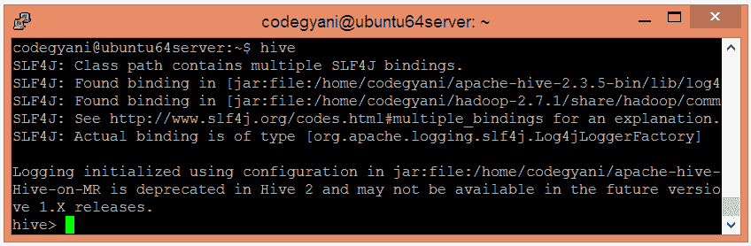

# ApacheHive安装

> 原文：<https://www.javatpoint.com/hive-installation>

在本节中，我们将执行 Hive 安装。

## 先决条件

*   **Java 安装** -使用以下命令检查 Java 是否安装。

```
$ java -version

```

*   **Hadoop 安装** -使用以下命令检查是否安装了 Hadoop。

```
$hadoop version

```

如果您的系统中没有安装它们中的任何一个，请按照以下链接安装。

## 安装 Apache Hive 的步骤

*   下载 Apache Hive tar 文件。

[http://mirrors.estointernet.in/apache/hive/hive-1.2.2/](http://mirrors.estointernet.in/apache/hive/hive-1.2.2/)

*   下载的 tar 文件。

```
tar -xvf apache-hive-1.2.2-bin.tar.gz

```

*   下载 bashrc 文件。

```
$ sudo nano ~/.bashrc

```

*   现在，提供以下 HIVE_HOME 路径。

```
export HIVE_HOME=/home/codegyani/apache-hive-1.2.2-bin
export PATH=$PATH:/home/codegyani/apache-hive-1.2.2-bin/bin

```

*   重复环境变量的日期。

```
$ source ~/.bashrc

```

*   让我们通过提供以下命令来启动Hive。

```
$ hive

```

