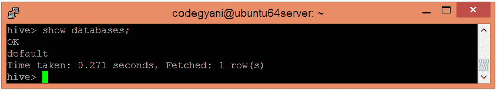
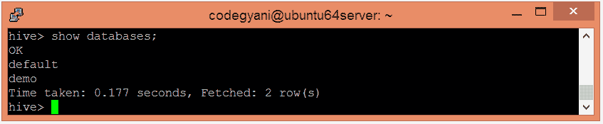
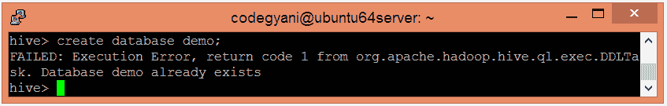
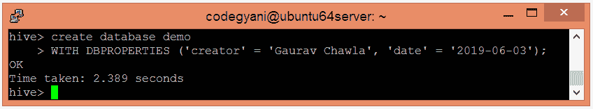
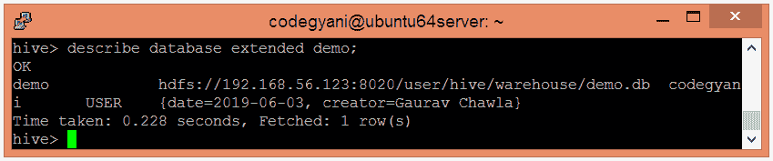

# Hive-创建数据库

> 原文：<https://www.javatpoint.com/hive-create-database>

在 Hive 中，数据库被视为表的目录或命名空间。因此，我们可以在一个数据库中维护多个表，每个表都有一个唯一的名称。Hive 还提供了一个名为**默认**的默认数据库。

*   首先，我们检查 Hive 提供的默认数据库。因此，要检查现有数据库的列表，请遵循以下命令:-

```

hive> show databases;

```



在这里，我们可以看到 Hive 提供的默认数据库的存在。

*   让我们使用以下命令创建一个新的数据库

```

hive> create database demo;

```


因此，创建了一个新的数据库。

*   让我们检查新创建的数据库是否存在。

```

hive> show databases;

```



*   每个数据库必须包含唯一的名称。如果我们创建两个同名的数据库，会产生以下错误:-



*   如果我们想抑制 Hive 在创建同名数据库时生成的警告，请执行以下命令:-

```

hive> create a database if not exists demo;

```


*   Hive 还允许以键值对的形式向数据库分配属性。

```

hive>create the database demo
		>WITH DBPROPERTIES ('creator' = 'Gaurav Chawla', 'date' = '2019-06-03'); 

```



*   让我们检索与数据库相关的信息。

```

hive> describe database extended demo;

```

