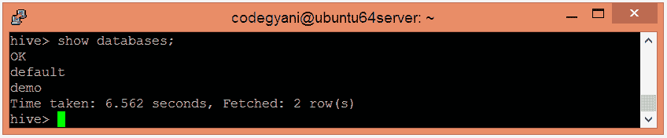
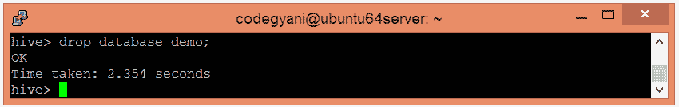
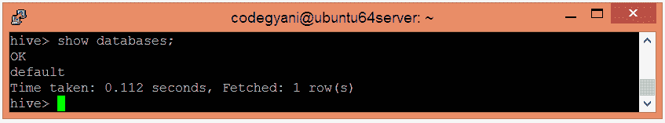
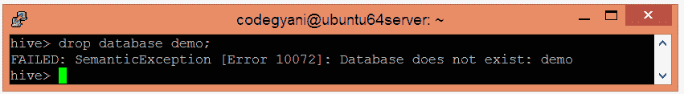
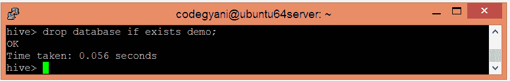

# Hive 数据库

> 原文：<https://www.javatpoint.com/hive-drop-database>

在本节中，我们将看到删除现有数据库的各种方法。

*   让我们使用以下命令检查现有数据库的列表:-

```

hive> show databases;

```



*   现在，使用以下命令删除数据库。

```

hive> drop database demo;

```



*   让我们检查数据库是否被删除。

```

hive> show databases;

```



我们可以看到，数据库**演示**不在列表中。因此，数据库被成功删除。

*   如果我们尝试删除不存在的数据库，将生成以下错误:



*   但是，如果我们想要抑制 Hive 在创建同名数据库时生成的警告，请遵循以下命令:-

```

hive> drop database if exists demo;

```



*   在 Hive 中，不允许直接删除包含表的数据库。在这种情况下，我们可以通过首先删除表或者在命令中使用 Cascade 关键字来删除数据库。
*   让我们看看用于删除数据库的级联命令:-

```

hive> drop database if exists demo cascade;

```

该命令首先自动删除数据库中的表。