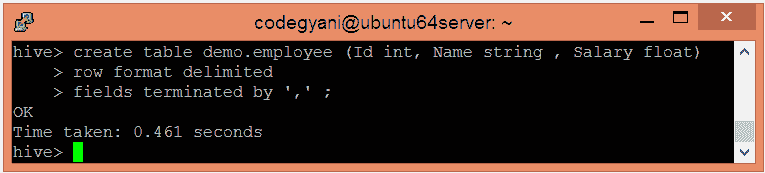
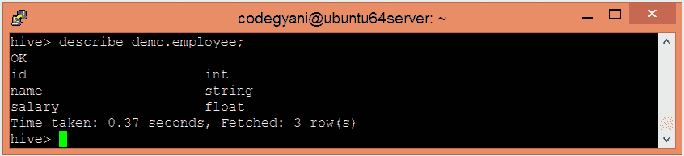
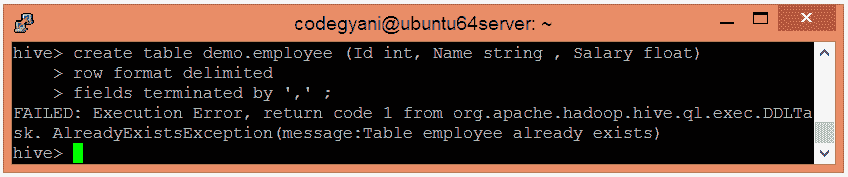
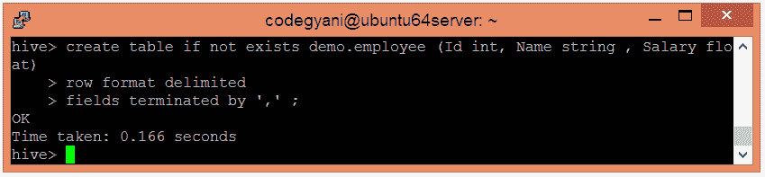
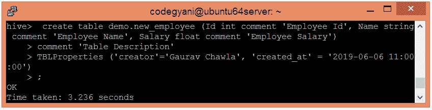
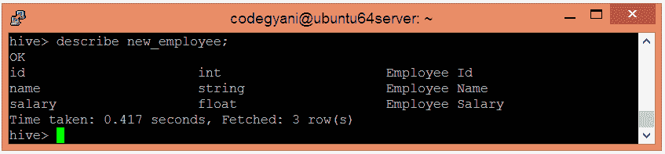
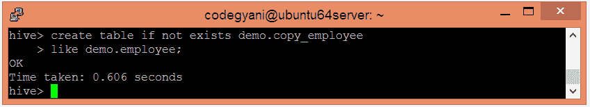
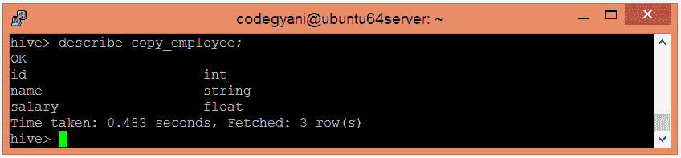
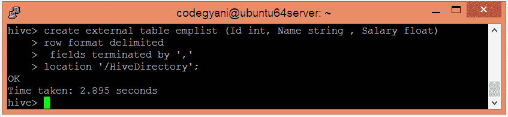
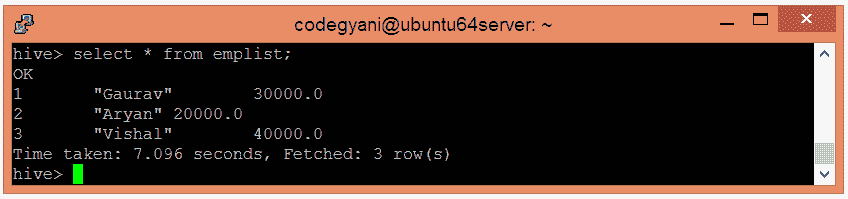

# Hive-创建表

> 原文：<https://www.javatpoint.com/hive-create-table>

在 Hive 中，我们可以使用类似于 SQL 的约定来创建一个表。它支持存储表数据文件的广泛灵活性。它提供两种类型的表:-

*   内部表
*   外部表

## 内部表

内部表也称为托管表，因为它们的数据生命周期由 Hive 控制。默认情况下，这些表存储在 hive.metastore.warehouse.dir(即/user/hive/warehouse)定义的目录下的子目录中。内部表不够灵活，无法与 Pig 等其他工具共享。如果我们试图删除内部表，Hive 会删除表模式和数据。

*   让我们使用以下命令创建一个内部表:-

```

hive> create table demo.employee (Id int, Name string , Salary float)
row format delimited
fields terminated by ',' ;

```



这里，该命令还包括数据由“，”分隔的信息。

*   让我们使用以下命令来查看创建的表的元数据:-

```

hive> describe demo.employee

```



*   当我们再次尝试创建现有表时，让我们看看结果。



在这种情况下，就会出现异常。如果我们想忽略这种类型的异常，我们可以在创建表格时使用**如果不存在**命令。

```

hive> create table if not exists demo.employee (Id int, Name string , Salary float)
row format delimited
fields terminated by ',' ; 

```



*   创建表时，我们可以向列中添加注释，也可以定义表属性。

```

hive> create table demo.new_employee (Id int comment 'Employee Id', Name string comment 'Employee Name', Salary float comment 'Employee Salary')
comment 'Table Description'
TBLProperties ('creator'='Gaurav Chawla', 'created_at' = '2019-06-06 11:00:00');

```



*   让我们使用以下命令来查看创建的表的元数据:-

```

hive> describe new_employee;

```



*   Hive 允许使用现有表的模式创建新表。

```

hive> create table if not exists demo.copy_employee
like demo.employee;

```




这里，我们可以说新表是现有表的副本。

## 外部表

外部表允许我们从外部创建和访问表和数据。**外部**关键字用于指定外部表，而**位置**关键字用于确定加载数据的位置。

由于表是外部的，数据不在 Hive 目录中。因此，如果我们试图删除该表，该表的元数据将被删除，但数据仍然存在。

要创建外部表，请执行以下步骤:-

*   让我们使用以下命令在 HDFS 创建一个目录

```

hdfs dfs -mkdir /HiveDirectory

```

*   现在，将文件存储在创建的目录中。

```

hdfs dfs -put hive/emp_details /HiveDirectory

```

*   让我们使用以下命令创建一个外部表:-

```

hive> create external table emplist (Id int, Name string , Salary float)
row format delimited
 fields terminated by ',' 
location '/HiveDirectory';

```



*   现在，我们可以使用以下命令来检索数据

```

select * from emplist;

```

