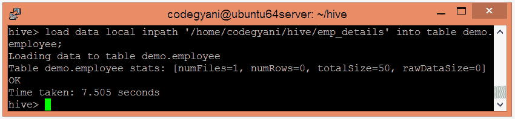
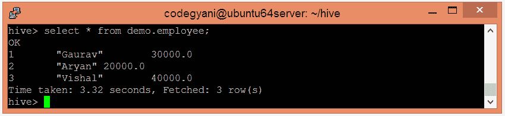
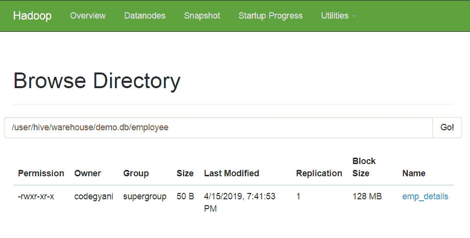
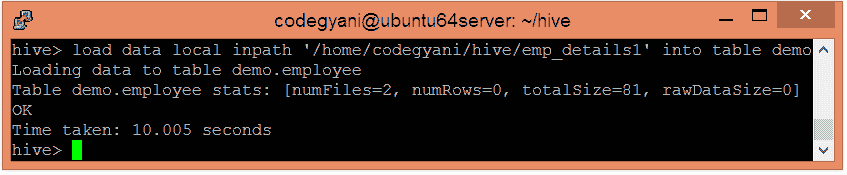
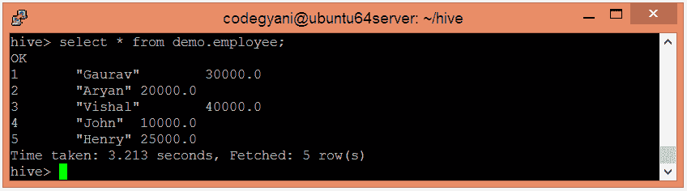
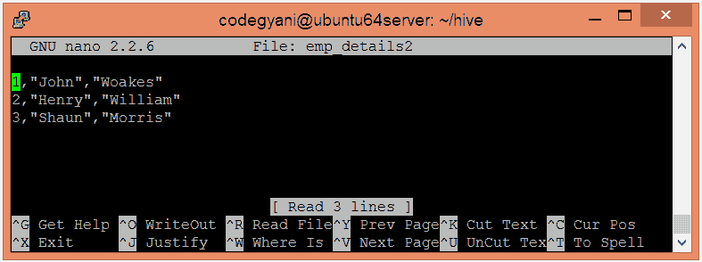
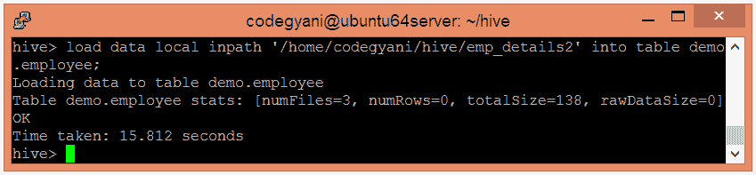
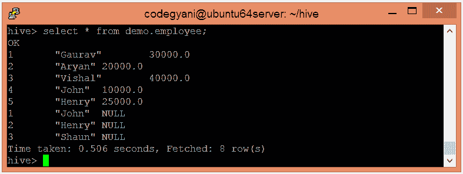

# Hive 加载数据

> 原文：<https://www.javatpoint.com/hive-load-data>

一旦创建了内部表，下一步就是将数据加载到其中。因此，在 Hive 中，我们可以轻松地将数据从任何文件加载到数据库中。

*   让我们使用以下命令将文件的数据加载到数据库中

```

load data local inpath '/home/codegyani/hive/emp_details' into table demo.employee;

```



这里， **emp_details** 是包含数据的文件名。

*   现在，我们可以使用以下命令从数据库中检索数据。

```

select * from demo.employee;

```




*   如果我们想在当前数据库中添加更多的数据，只需更新新的文件名就可以再次执行相同的查询。

```

load data local inpath '/home/codegyani/hive/emp_details1' into table demo.employee;

```



*   让我们检查一下更新后的表格的数据



*   在 Hive 中，如果我们试图加载不匹配的数据(即一个或多个列数据与指定表列的数据类型不匹配)，它不会抛出任何异常。但是，它将空值存储在不匹配元组的位置。
*   让我们向当前表中再添加一个文件。该文件包含不匹配的数据。



这里，第三列包含字符串类型的数据，该表允许浮点类型的数据。因此，这种情况出现在数据不匹配的情况下。

*   现在，将数据加载到表中。

```

load data local inpath '/home/codegyani/hive/emp_details2' into table demo.employee;

```



这里，数据加载成功。

*   让我们去取桌子的记录。

```

select * from demo.employee

```



这里，我们可以在不匹配数据的位置看到空值。