# Hive-改变表

> 原文：<https://www.javatpoint.com/hive-alter-table>

在 Hive 中，我们可以对现有的表进行修改，比如更改表名、列名、注释和表属性。它提供类似 SQL 的命令来改变表。

### 重命名表格

如果我们想更改现有表的名称，我们可以使用以下签名重命名该表:-

```

Alter table old_table_name rename to new_table_name;

```

*   让我们看看当前数据库中现有的表。

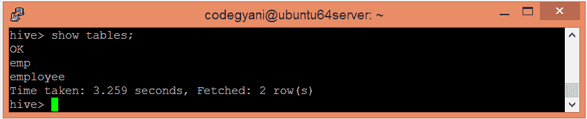

*   现在，使用以下命令更改表的名称

```

Alter table emp rename to employee_data;

```

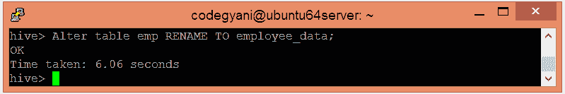

*   让我们检查一下名字是否有变化。

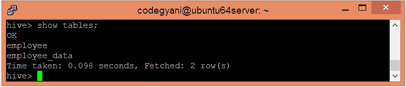

在这里，我们得到了期望的输出。

* * *

### 添加列

在 Hive 中，我们可以使用以下签名在现有表中添加一列或多列:-

```

Alter table table_name add columns(column_name datatype);

```

*   让我们看看表的模式。

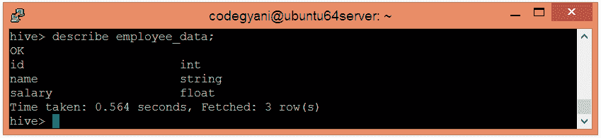

*   让我们看看表中是否存在列的数据。

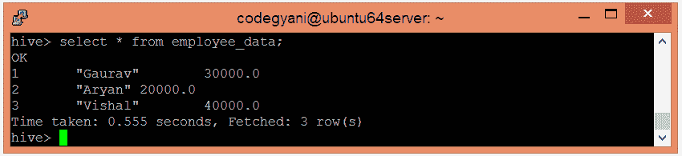

*   现在，使用以下命令向表中添加一个新列:-

```

Alter table employee_data add columns (age int);

```

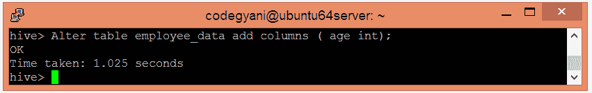

*   让我们看看表的更新模式。


*   让我们看看表格的更新数据。

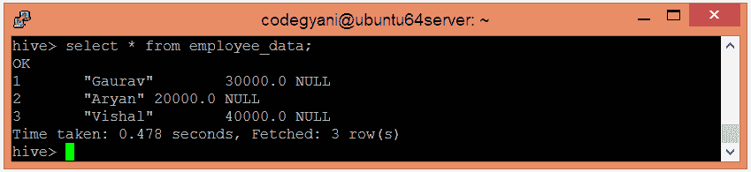

由于我们没有向新列中添加任何数据，hive 认为空值为该值。

* * *

### 更改列

在 Hive 中，我们可以重命名一个列，改变它的类型和位置。在这里，我们使用以下签名来更改列的名称:-

```

Alter table table_name change old_column_name new_column_name  datatype; 

```

*   让我们看看表的现有模式。

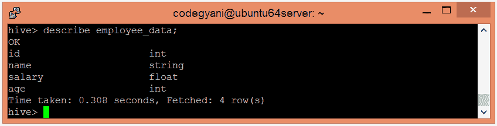

*   现在，使用以下命令更改列名:-

```

Alter table employee_data change name first_name string;

```

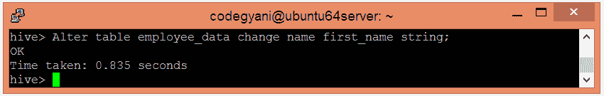

*   让我们检查列名是否已更改。

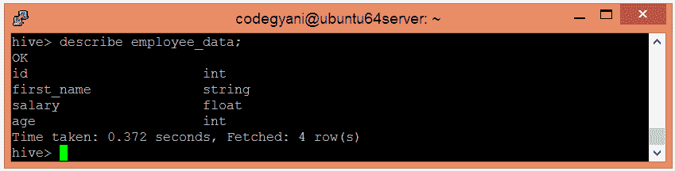

* * *

### 删除或替换列

Hive 允许我们通过用新列替换一个或多个列来删除它们。因此，我们不能直接删除该列。

*   让我们看看表的现有模式。


*   现在，从表中删除一列。

```

alter table employee_data replace columns( id string, first_name string, age int);

```

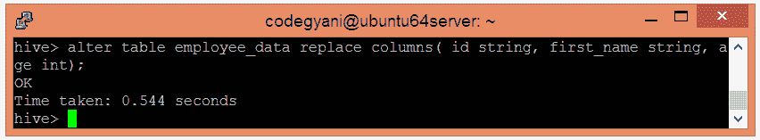

*   让我们检查一下柱子是否掉了。

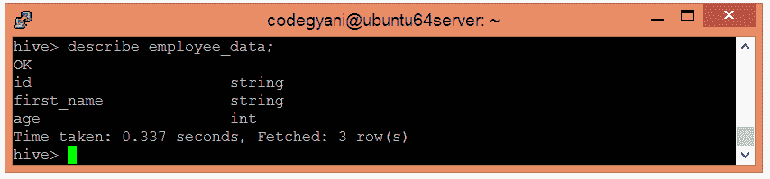

在这里，我们得到了期望的输出。