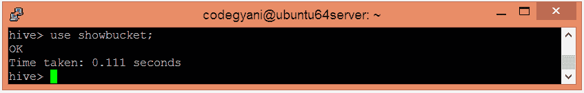

# 在蜂巢里颠簸

> 原文：<https://www.javatpoint.com/bucketing-in-hive>

Hive 中的桶是一种数据组织技术。它类似于 Hive 中的分区，增加了一项功能，将大型数据集划分为更易于管理的部分，称为桶。因此，当分区的实现变得困难时，我们可以在 Hive 中使用 bucketing。但是，我们也可以在桶中进一步划分分区。

## 蜂巢中的桶工作


*   桶的概念是基于散列技术。
*   这里，计算当前列值和所需桶数的模块(假设 F(x) % 3)。
*   现在，根据结果值，数据被存储到相应的存储桶中。

### 蜂巢中的桶示例

*   首先，选择要在其中创建表的数据库。

```

hive> use showbucket;

```



*   创建一个虚拟表来存储数据。

```

hive> create table emp_demo (Id int, Name string , Salary float)  
row format delimited  
fields terminated by ',' ; 

```


*   现在，将数据加载到表中。

```

hive> load data local inpath '/home/codegyani/hive/emp_details' into table emp_demo;

```


*   使用以下命令启用桶

```

hive> set hive.enforce.bucketing = true;

```

*   使用以下命令创建一个桶表:-

```

hive> create table emp_bucket(Id int, Name string , Salary float)  
clustered by (Id) into 3 buckets
row format delimited  
fields terminated by ',' ;  

```


*   现在，将虚拟表的数据插入分桶表。

```

hive> insert overwrite table emp_bucket select * from emp_demo;	

```


*   在这里，我们可以看到数据分为三个桶。


*   让我们检索桶 0 的数据。


根据哈希函数:
6%3=0
3%3=0
所以，这些列存储在桶 0 中。

*   让我们检索桶 1 的数据。


根据哈希函数:
7%3=1
4%3=1
1%3=1
所以，这些列存储在桶 1 中。

*   让我们检索桶 2 的数据。


根据哈希函数:
8%3=2
5%3=2
2%3=2
所以，这些列存储在桶 2 中。