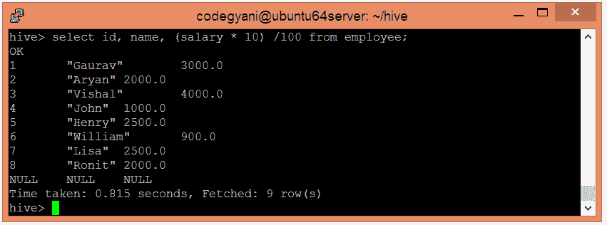

# 高级操作员

> 原文：<https://www.javatpoint.com/hiveql-operators>

HiveQL 运算符便于执行各种算术和关系运算。在这里，我们将对下表的记录执行此类操作:


### Hive 中的操作员示例

让我们创建一个表，并使用以下步骤将数据加载到其中:-

*   选择要在其中创建表的数据库。

```

hive> use hql;  

```

*   使用以下命令创建 Hive 表:-

```

hive> create table employee (Id int, Name string , Salary float)  
row format delimited  
fields terminated by ',' ; 

```

*   现在，将数据加载到表中。

```

hive> load data local inpath '/home/codegyani/hive/emp_data' into table employee;

```

*   让我们使用以下命令获取加载的数据:-

```

hive> select * from employee;

```


现在，我们用相应的例子讨论算术和关系运算符。

## Hive 中的算术运算符

在 Hive 中，算术运算符接受任何数字类型。常用的算术运算符有:-

| 经营者 | 描述 |
| A + B | 这是用来加 A 和 b 的。 |
| 美国罗克韦尔 | 这个用来从 a 中减去 B。 |
| 甲*乙 | 这是用来乘 A 和 b 的。 |
| 甲乙 | 这用于除 A 和 B，并返回操作数的商。 |
| 甲%乙 | 这将返回应收帐款的剩余部分 |
| 甲&#124;乙 | 这用于确定 A 和 b 的按位“或” |
| 水果派 | 这用于确定 A 和 b 的按位“与” |
| 有 | 这用于确定 A 和 b 的按位异或 |
| ~A | 这用于确定 a 的按位非 |

### Hive 中算术运算符的例子

*   让我们看一个例子，每个员工的工资增加 50。

```

hive> select id, name, salary + 50 from employee;

```


*   让我们看一个例子，每个员工的工资减少 50。

```

hive> select id, name, salary - 50 from employee;  

```


*   让我们看一个例子，找出每个员工 10%的工资。

```

hive> select id, name, (salary * 10) /100 from employee;  

```



## Hive 中的关系运算符

在 Hive 中，关系运算符通常与 Join 和 Hive 这样的子句一起使用，以比较现有的记录。常用的关系运算符有:-

| 操作员 | 描述 |
| A=B | 如果 A 等于 B，则返回真，否则返回假。 |
| A <> B，A！=B | 如果 A 或 B 为空，则返回空；如果 A 不等于 B，则为真，否则为假。 |
| 甲 | 如果 A 或 B 为空，则返回空；如果 A 小于 B，则为真，否则为假。 |
| 甲>乙 | 如果 A 或 B 为空，则返回空；如果 A 大于 B，则为真，否则为假。 |
| A<=B | 如果 A 或 B 为空，则返回空；如果 A 小于或等于 B，则为 true，否则为 false。 |
| 甲> =乙 | 如果 A 或 B 为空，则返回空；如果 A 大于或等于 B，则为 true，否则为 false。 |
| 一个是空的 | 如果 A 的计算结果为空，则返回真，否则返回假。 |
| 不为空 | 如果 A 的计算结果为空，则返回 false，否则返回 true。 |

### Hive 中的关系运算符示例

*   让我们看一个例子来获取工资> =25000 的员工的详细信息。

```

hive> select * from employee where salary >= 25000;

```


*   让我们看一个例子来获取工资< 25000 的员工的详细信息。

```

hive> select * from employee where salary < 25000;

```

