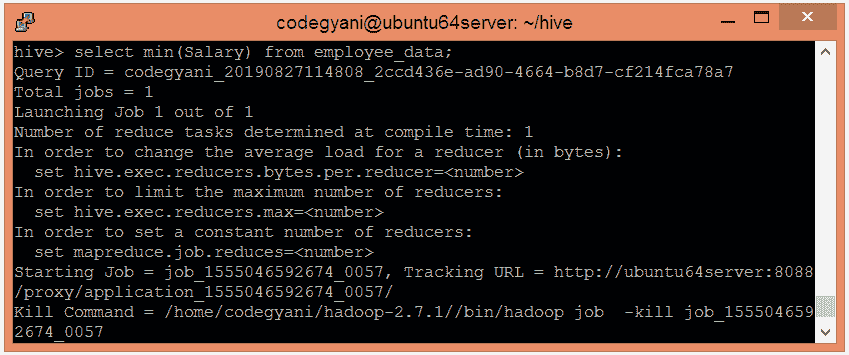

# 功能

> 原文：<https://www.javatpoint.com/hiveql-functions>

Hive 提供各种内置函数来执行数学和聚合类型操作。在这里，我们将对下表的记录执行这种类型的函数:


### 蜂巢中的函数示例

让我们创建一个表，并使用以下步骤将数据加载到其中:-

*   选择要在其中创建表的数据库。

```

hive> use hql;  

```

*   使用以下命令创建配置单元表:-

```

hive> create table employee_data (Id int, Name string , Salary float)  
row format delimited  
fields terminated by ',' ; 

```

*   现在，将数据加载到表中。

```

hive> load data local inpath '/home/codegyani/hive/emp_details' into table employee_data;

```

*   让我们使用以下命令获取加载的数据:-

```

hive> select * from employee_data;

```


现在，我们用相应的例子讨论数学、聚合和其他内置函数。

## 蜂巢中的数学函数

蜂巢中常用的数学函数有:-

| 返回类型 | 功能 | 描述 |
| 比吉斯本 | 圆形(num) | 它返回取整后的 DOUBLE num 值的 BIGINT。 |
| 比吉斯本 | 楼板(num) | 它返回小于或等于 num 的最大 BIGINT。 |
| 比吉斯本 | 天花板(数字)，天花板(双数字) | 它返回大于或等于 num 的最小 BIGINT。 |
| 两倍 | exp(数字) | 它返回数的指数。 |
| 两倍 | ln(数字) | 它返回 num 的自然对数。 |
| 两倍 | 日志 10(num) | 它返回 num 的以 10 为底的对数。 |
| 两倍 | sqrt(数字) | 它返回 num 的平方根。 |
| 两倍 | abs(数字) | 它返回 num 的绝对值。 |
| 两倍 | 罪恶(d) | 它以弧度为单位返回 num 的 sin。 |
| 两倍 | asin(d) | 它以弧度为单位返回 num 的反正弦。 |
| 两倍 | cos(d) | 它以弧度为单位返回 num 的余弦值。 |
| 两倍 | 阿科斯（d） | 它以弧度为单位返回 num 的反余弦值。 |
| 两倍 | tan(d) | 它以弧度为单位返回 num 的正切值。 |
| 两倍 | 阿坦(d) | 它以弧度为单位返回 num 的反正切值。 |

### 蜂巢中的数学函数示例

*   让我们看一个获取每个员工工资平方根的例子。

```

hive> select Id, Name, sqrt(Salary) from employee_data ;  

```


## 配置单元中的聚合函数

在 Hive 中，聚合函数返回由多行计算得到的单个值。让我们看看一些常用的聚合函数:-

| 返回类型 | 操作员 | 描述 |
| 比吉斯本 | 计数(*) | 它返回文件中存在的行数。 |
| 两倍 | 总和(栏) | 它返回值的总和。 |
| 两倍 | 总和(DISTINCT 列) | 它返回不同值的总和。 |
| 两倍 | 平均值(列) | 它返回值的平均值。 |
| 两倍 | 平均值(DISTINCT 列) | 它返回不同值的平均值。 |
| 两倍 | 最小(列) | 它比较这些值，并从中返回最小值。 |
| 两倍 | 最大值(列) | 它比较这些值，并从中返回最大值。 |

### 配置单元中聚合函数的示例

*   让我们看一个获取员工最高工资的例子。

```

hive> select max(Salary) from employee_data;

```


*   让我们看一个获取员工最低工资的例子。

```

hive> select min(Salary) from employee_data;

```




## 配置单元中的其他内置函数

以下是配置单元中其他一些常用的内置函数

| 返回类型 | 操作员 | 描述 |
| （同 Internationalorganizations）国际组织 | 长度(字符串) | 它返回字符串的长度。 |
| 线 | 反向(字符串) | 它以相反的顺序返回字符串。 |
| 线 | concat(str1、str2、-我...。） | 它返回两个或多个字符串的串联。 |
| 线 | 子字符串(字符串，起始索引) | 它根据提供的起始索引从字符串中返回子字符串。 |
| 线 | 子字符串(字符串，int 开始，int 长度) | 它根据提供的起始索引和长度从字符串中返回子字符串。 |
| 线 | 上部(字符串) | 它以大写形式返回字符串。 |
| 线 | 下部(字符串) | 它以小写形式返回字符串。 |
| 线 | 微调(字符串) | 它通过从两端移除空格来返回字符串。 |
| 线 | ltrim(str) | 它通过从左侧移除空格来返回字符串。 |
| string(字符串) | rtrim(str) | 它通过从右侧移除空格来返回字符串。 |

### Hive 中其他内置函数的示例

*   让我们看一个例子，以大写形式获取每个员工的姓名。

```

select Id, upper(Name) from employee_data;

```


*   让我们看一个以小写形式获取每个员工姓名的例子。

```

select Id, lower(Name) from employee_data;

```

