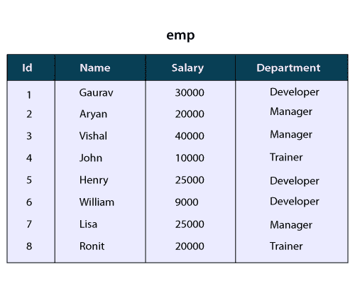
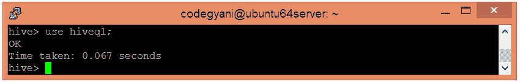
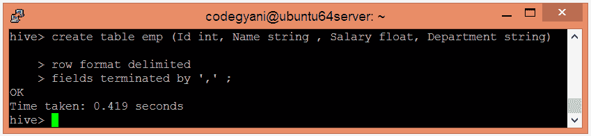
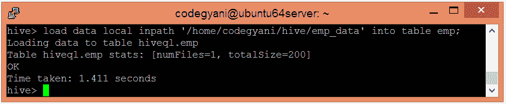
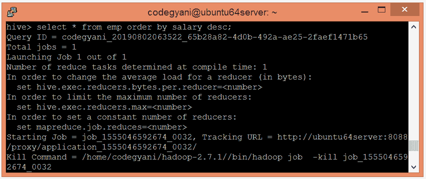
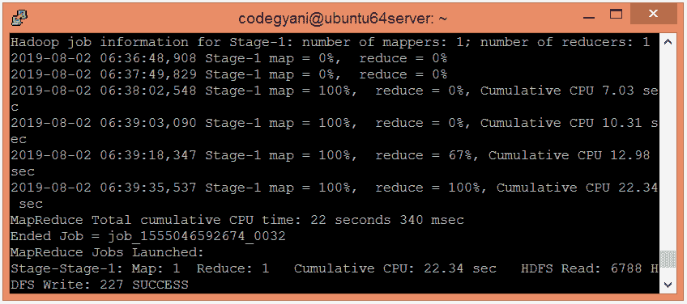
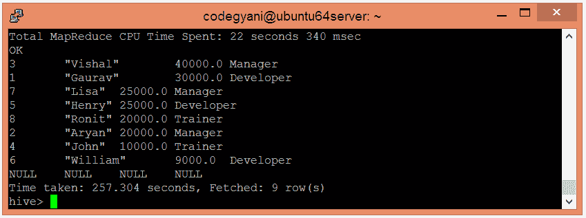
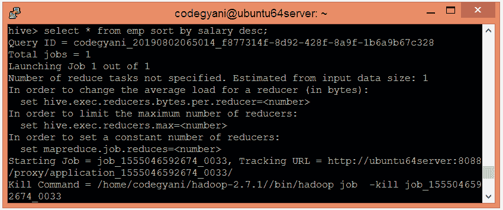
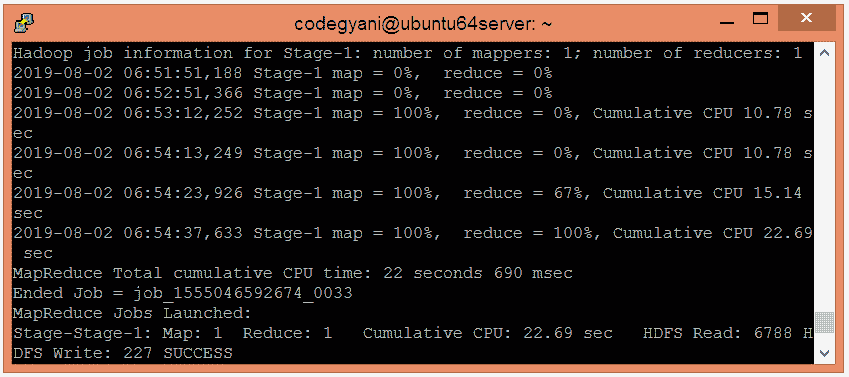

# HiveQL -排序依据和排序依据子句

> 原文：<https://www.javatpoint.com/hiveql-order-by-and-sort-by-clause>

通过使用 HiveQL ORDER BY 和 SORT BY 子句，我们可以对列应用排序。它以升序或降序返回结果集。在这里，我们将在下表的记录中执行这些子句:



## HiveQL -订单依据条款

在 HiveQL 中，ORDER BY 子句对查询结果集执行完整的排序。因此，完整的数据通过单个减速器传递。在执行大型数据集时，这可能需要很长时间。但是，我们可以使用 LIMIT 来最小化排序时间。

### Hive 中的 ORDER BY 子句示例

让我们看一个使用 order by 子句按排序顺序排列数据的例子。

*   选择要在其中创建表的数据库。

```

hive> use hiveql;

```



*   现在，使用以下命令创建一个表:

```

hive> create table emp (Id int, Name string , Salary float, Department string)  
row format delimited  
fields terminated by ',' ; 

```



*   将数据加载到表中。

```

hive> load data local inpath '/home/codegyani/hive/emp_data' into table emp;

```



*   现在，使用以下命令按降序获取数据:

```

hive> select * from emp order by salary desc;

```





在这里，我们得到了想要的结果。

## HiveQL -排序依据子句

HiveQL 排序依据子句是 ORDER BY 子句的替代。它对每个减速器内的数据进行排序。因此，它执行本地排序，其中每个减速器的输出被单独排序。它也可能给出部分有序的结果。

### Hive 中排序依据子句的示例

在这个例子中，我们使用 SORT BY 子句按照排序顺序排列数据。

*   让我们使用以下命令以降序获取数据:

```

hive> select * from emp sort by salary desc;

```





在这里，我们得到了想要的结果。