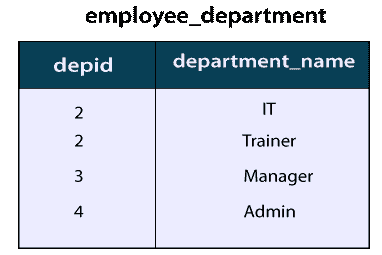
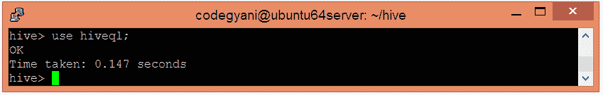
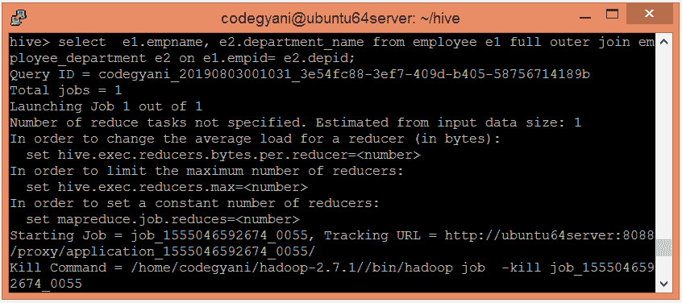

# HiveQL 连接

> 原文：<https://www.javatpoint.com/hiveql-join>

HiveQL Join 子句用于根据两个或多个表之间的相关列来组合它们的数据。HiveQL 连接的各种类型有:-

*   内部连接
*   左外连接
*   右外连接
*   完全外部连接

在这里，我们将对下表的记录执行 join 子句:




## HiveQL 中的内部连接

HiveQL 内部联接用于返回多个表中满足联接条件的行。换句话说，连接条件在每个被连接的表中查找匹配记录。


## Hive 中的内部连接示例

在本例中，我们采用两个表 employee 和 employee_department。employee 表的主键(empid)代表 employee_department 表的外键(depid)。让我们通过以下步骤来执行内部连接操作:-

*   选择要在其中创建表的数据库。

```

hive> use hiveql;

```



*   现在，使用以下命令创建一个表:

```

hive> create table employee(empid int, empname string , state string)
row format delimited
fields terminated by ',' ;

```


*   将相应的数据加载到表中。

```

hive> load data local inpath '/home/codegyani/hive/employee' into table employee;

```


*   现在，使用以下命令创建另一个表:

```

hive> create table employee_department(depid int, department_name string)
row format delimited
fields terminated by ',' ;

```


*   将相应的数据加载到表中。

```

hive> load data local inpath '/home/codegyani/hive/employee_department' into table employee_department;

```


*   现在，使用以下命令执行内部连接操作:-

```

hive>select  e1.empname, e2.department_name from employee e1 join employee_department e2 on e1.empid= e2.depid;

```


## HiveQL 中的左外连接

HiveQL 左外连接返回左(第一个)表中的所有记录，并且只返回右(第二个)表中符合连接条件的记录。


### Hive 中左外部连接的示例

在这个例子中，我们执行左外连接操作。

*   让我们使用以下命令执行左外部连接操作:-

```

hive> select  e1.empname, e2.department_name from employee e1 left outer join employee_department e2 on e1.empid= e2.depid;

```


## HiveQL 中的右外连接

HiveQL 右外连接返回右(第二)表中的所有记录，并且只返回左(第一)表中连接条件匹配的记录。


### Hive 中左外部连接的示例

在这个例子中，我们执行左外连接操作。

*   让我们使用以下命令执行左外部连接操作:-

```

hive> select  e1.empname, e2.department_name from employee e1 right outer join employee_department e2 on e1.empid= e2.depid;

```


## 完全外部连接

HiveQL 完全外部连接返回两个表中的所有记录。它为任一表中缺失的记录分配空值。


### Hive 中完全外部连接的示例

在这个例子中，我们执行完全外部连接操作。

*   让我们使用以下命令来执行完全外部连接操作:-

```

select  e1.empname, e2.department_name from employee e1 full outer join employee_department e2 on e1.empid= e2.depid;

```



