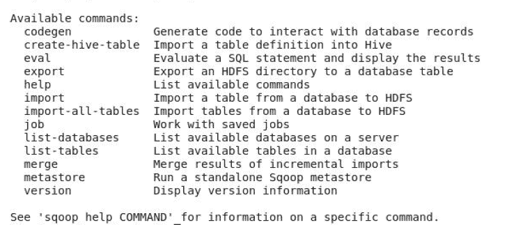

# 正在启动 Sqoop

> 原文：<https://www.javatpoint.com/starting-sqoop>

Sqoop 是一个命令行工具，具有以下结构

```
sqoop TOOL PROPERTY_ARGS SQOOP_ARGS [-- EXTRA_ARGS]

```

*   工具指示操作，例如:“导入”、“导出”。
*   属性 _ARGS 是格式为“-Dname=value”的 Java 属性
*   ARGS 提到了各种 SQOOP 参数
*   EXTRA_ARGS 用于专用连接器，用“-”号与 SQOOP_ARGS 分开

示例:

```
% sqoop import --connect jdbc:mysql://localhost/hadoopguide --table widgets -m 1

```

键入“sqoop 帮助”以获取所有可用的工具:



## 后端会发生什么

当您决定将数据从关系数据库管理系统转移到 HDFS 时，第一个投入使用的产品是 Apache Sqoop。当您请求将数据带到 HDFS 时，会发生以下情况。

1.  Sqoop 向关系数据库请求元数据信息。
2.  关系数据库返回所需的请求。
3.  基于元数据信息，Sqoop 生成 java 类。
4.  基于主 id 的分区发生在表中，因为多个映射器将同时导入数据。