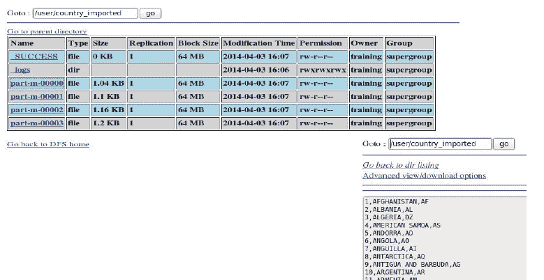

# Sqoop 导入

> 哎哎哎:# t0]https://www . javatppoint . com/sqoop-import

我们在 mySql 数据库中有表，我们必须使用 Sqoop 将其导入 HDFS。要查看表格中的内容，请在 mySql 提示符下键入以下命令。

```
mysql> select * from table_name limit 10

```


将“国家”表导入我们的 HDFS 环境:

```
$ sqoop import --connect "jdbc:mysql://localhost/training" --username cloudera -P --table 
cloudera -target-dir /user/country_imported

```

在一行中键入上述命令。

这里-m 1 为每个表指定一个映射器。所有的表都是在默认目录下下载的。默认使用的映射器数量为 4。您可以通过将命令附加“-m _ number of _ mapper”来更改这一点。

