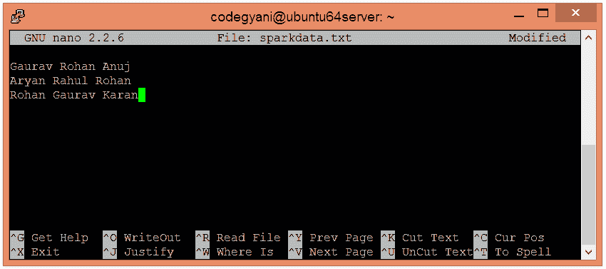
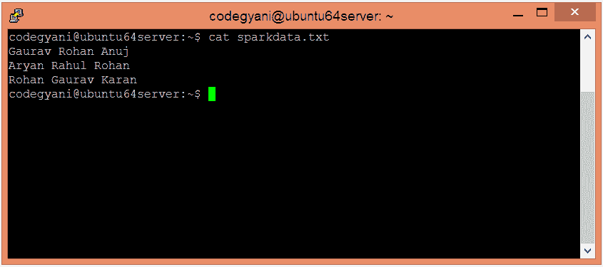
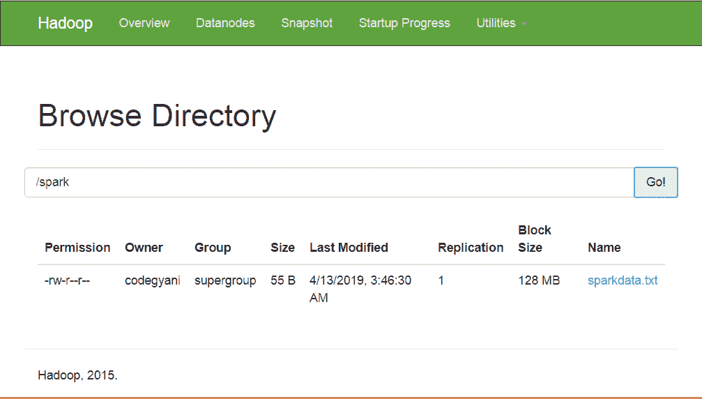
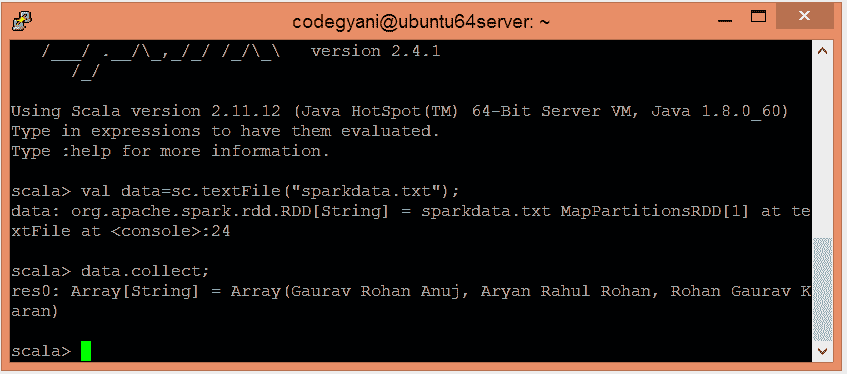
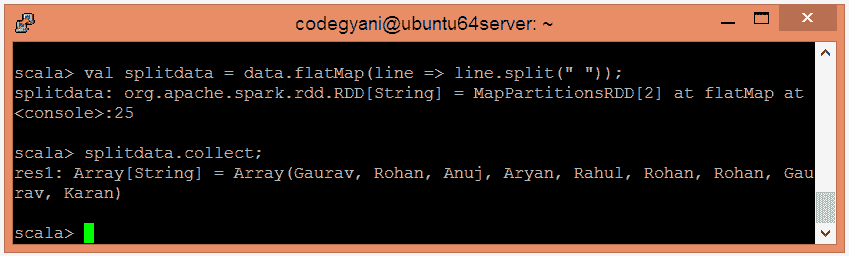
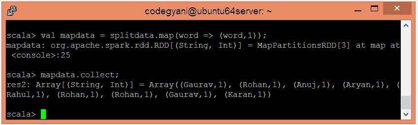
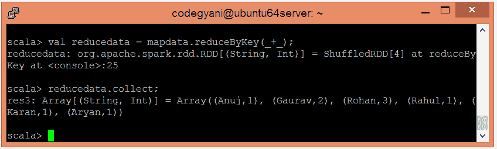

# 火花字数示例

> 原文：<https://www.javatpoint.com/apache-spark-word-count-example>

在 Spark 字数统计示例中，我们发现每个单词在特定文件中存在的频率。这里，我们使用 Scala 语言来执行 Spark 操作。

## 执行火花字数示例的步骤

在这个例子中，我们找到并显示每个单词的出现次数。

*   在本地机器上创建一个文本文件，并在其中写入一些文本。

```

$ nano sparkdata.txt 

```



*   检查 sparkdata.txt 文件中写入的文本。

```

$ cat sparkdata.txt

```



*   在 HDFS 创建一个目录，在那里保存文本文件。

```

$ hdfs dfs -mkdir /spark

```

*   将 HDFS 的 sparkdata.txt 文件上传到特定目录。

```

$ hdfs dfs -put /home/codegyani/sparkdata.txt /spark

```



*   现在，按照下面的命令在 Scala 模式下打开火花。

```

$ spark-shell

```


*   让我们使用以下命令创建一个 RDD。

```

scala> val data=sc.textFile("sparkdata.txt")

```

在这里，传递包含数据的任何文件名。

*   现在，我们可以使用以下命令读取生成的结果。

```

scala> data.collect;

```



*   这里，我们使用以下命令将现有数据以单个单词的形式拆分。

```

scala> val splitdata = data.flatMap(line => line.split(" "));

```

*   现在，我们可以使用以下命令读取生成的结果。

```

scala> splitdata.collect;

```



*   现在，执行地图操作。

```

scala> val mapdata = splitdata.map(word => (word,1));

```

这里，我们给每个单词赋值 1。

*   现在，我们可以使用以下命令读取生成的结果。

```

scala> mapdata.collect;

```



*   现在，执行减少操作

```

scala> val reducedata = mapdata.reduceByKey(_+_);

```

这里，我们总结了生成的数据。

*   现在，我们可以使用以下命令读取生成的结果。

```

scala> reducedata.collect;

```



在这里，我们得到了期望的输出。

* * *