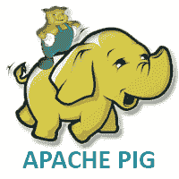

# 阿帕奇猪教程

> 原文：<https://www.javatpoint.com/pig>

小猪教程提供了小猪的基本概念和高级概念。我们的小猪教程是为初学者和专业人士设计的。

Pig 是一个执行 Map Reduce 程序的高级数据流平台。是雅虎开发的。猪的语言是猪拉丁语。

我们的 Pig 教程包括所有关于 Apache Pig 的主题，包括 Pig 用法、Pig 安装、Pig 运行模式、Pig 拉丁概念、Pig 数据类型、Pig 示例、Pig 用户定义函数等。

## 先决条件

在学习 Pig 之前，你必须具备 Hadoop 的基础知识。

## 观众

我们的养猪教程旨在帮助初学者和专业人士。

## 问题

我们保证您在本小猪教程中不会发现任何问题。但是如果有任何错误，请在联系表格中发布问题。