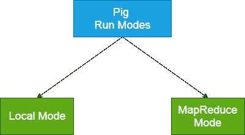

# ApachePig 跑模式

> 原文：<https://www.javatpoint.com/pig-run-modes>

Apache Pig 以两种模式执行:本地模式和 MapReduce 模式。



## 本地方式

*   它在单个 JVM 中执行，用于开发实验和原型制作。
*   这里，文件是使用 localhost 安装和运行的。
*   本地模式适用于本地文件系统。存储在本地文件系统中的输入和输出数据。

本地模式咕噜外壳的命令:

```
$ pig-x local  

```

## MapReduce 模式

*   MapReduce 模式也称为 Hadoop 模式。
*   这是默认模式。
*   在本例中，Pig 将 Pig 拉丁语渲染成 MapReduce 作业，并在集群上执行它们。
*   它可以针对半分布式或全分布式 Hadoop 安装来执行。
*   这里，输入和输出数据出现在 HDFS。

地图缩小模式的命令:

```
 $ pig  

```

或者，

```
$ pig -x mapreduce

```

## 执行 PIG 计划的方法

以下是在本地和 MapReduce 模式下执行 Pig 程序的方法

*   **交互模式** -在该模式下，PIG 在咕噜人外壳中执行。要调用 Grunt shell，请运行 pig 命令。一旦执行了咕噜模式，我们就可以在命令行上交互式地提供 Pig 拉丁语语句和命令。
*   **批处理模式** -在该模式下，我们可以运行扩展名为. pig 的脚本文件。这些文件包含 PIG 拉丁命令。
*   **嵌入式模式** -在这个模式下，我们可以定义自己的功能。这些函数可以称为 UDF 函数(用户定义函数)。这里，我们使用像 Java 和 Python 这样的编程语言。