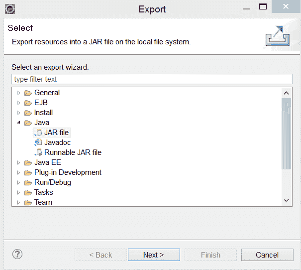
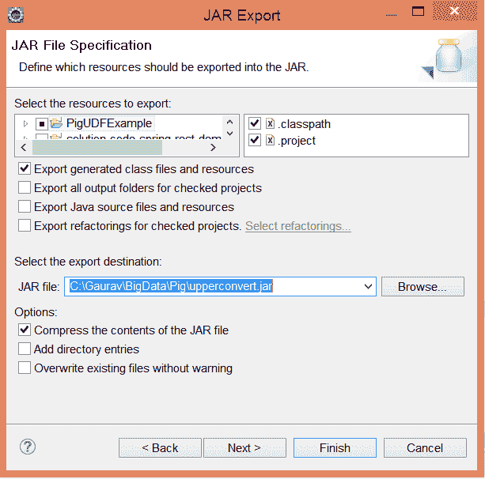
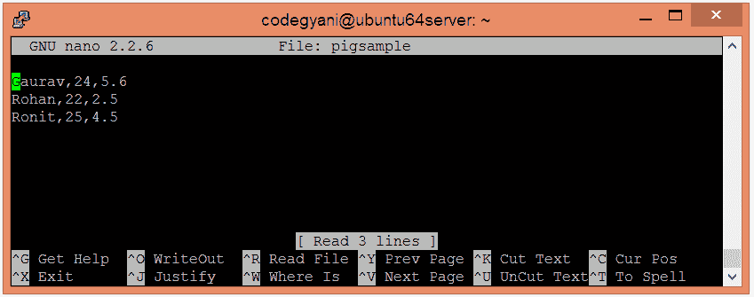
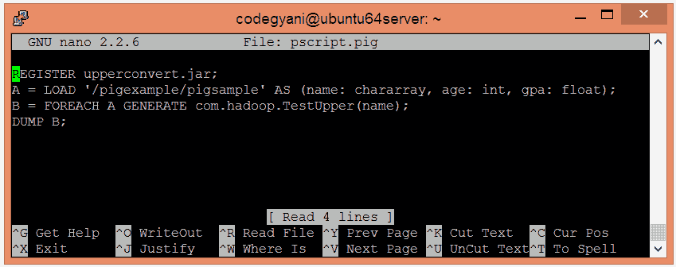
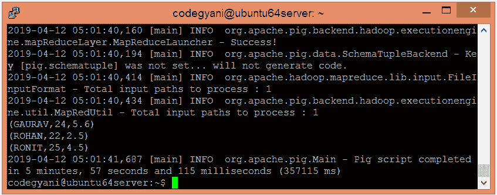

# 猪 UDF(用户定义函数)

> 哎哎哎:# t0]https://www . javatppoint . com/pig-UDF

为了指定自定义处理，Pig 提供了对用户定义函数(UDF)的支持。因此，猪允许我们创造自己的功能。目前，Pig UDFs 可以使用以下编程语言实现:-

*   爪哇
*   计算机编程语言
*   脚本语言
*   Java Script 语言
*   红宝石
*   绝妙的

在所有语言中，Pig 为 Java 函数提供了最广泛的支持。但是，对 Python、Jython、JavaScript、Ruby 和 Groovy 等语言的支持有限。

## 猪 UDF 的例子

在《猪》中，

*   所有 UDF 必须扩展“org . Apache . pig . evalufunc”
*   所有函数都必须覆盖“exec”方法。

让我们看一个简单的 EVAL 函数将提供的字符串转换成大写的例子。

**UPPER.java**

```
package com.hadoop;

import java.io.IOException;

import org.apache.pig.EvalFunc;
import org.apache.pig.data.Tuple;

public class TestUpper extends EvalFunc {
	public String exec(Tuple input) throws IOException {  
		if (input == null || input.size() == 0)  
		return null;  
		try{  
		            String str = (String)input.get(0);  
		return str.toUpperCase();  
		}catch(Exception e){  
		throw new IOException("Caught exception processing input row ", e);  
		        }  
		    }
} 
```

*   创建 jar 文件并将其导出到特定的目录中。为此，右键单击项目- **导出- Java - JAR 文件-下一步**。



*   现在，为 jar 文件提供一个特定的名称，并将其保存在本地系统目录中。



*   在本地机器上创建一个文本文件，并插入元组列表。

```
$ nano pigsample

```



*   将 HDFS 的文本文件上传到特定目录。

```
$ hdfs dfs -put pigexample /pigexample

```

*   在本地机器上创建一个 pig 文件并编写脚本。

```
$ nano pscript.pig

```



*   现在，在终端中运行脚本以获得输出。

```
$pig pscript.pig

```



在这里，我们得到了期望的输出。

[Download the source code](https://static.javatpoint.com/hadooppages/pig/example/PigUDFExample.zip)