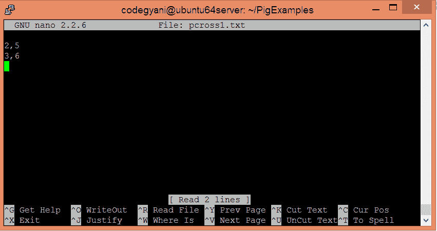
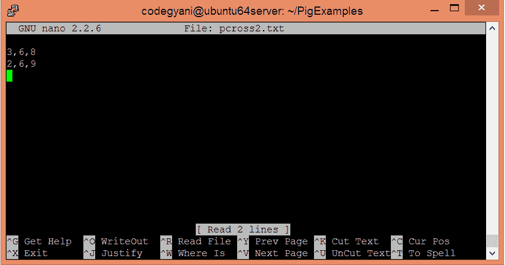
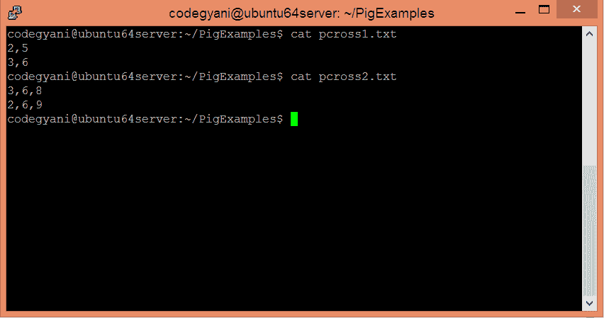
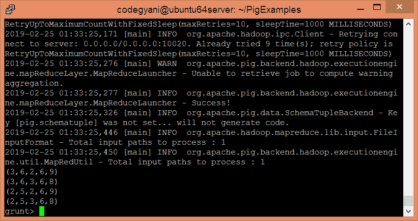

# ApachePig杂交算子

> 原文：<https://www.javatpoint.com/apache-pig-cross-operator>

Apache Pig CROSS 运算符便于计算两个或多个关系的叉积。使用 CROSS 运算符是一项昂贵的操作，应该谨慎使用。

## 交叉运算符示例

在这个例子中，我们计算两个关系的数据。

### 执行交叉运算符的步骤

*   在本地计算机上创建一个文本文件，并在其中写入一些值。

```

$ nano pcross1.txt

```



*   在本地计算机上创建另一个文本文件，并在其中写入一些值。

```

$ nano pcross2.txt

```



*   检查两个文本文件中写入的值。

```

$ cat pcross1.txt
$ cat pcross2.txt

```



*   将这两个文本文件上传到 HDFS 的特定目录中。

```

$ hdfs dfs -put pcross1.txt /pigexample
$ hdfs dfs -put pcross2.txt /pigexample

```

*   打开PIG MapReduce 运行模式。

```

$ pig

```

*   加载包含数据的文件。

```

grunt> A = LOAD '/pigexample/pcross1.txt' USING PigStorage(',') AS (a1:int,a2:int);

```

*   现在，执行并验证数据。

```

grunt> DUMP A;

```

*   加载包含数据的另一个文件。

```

grunt> B = LOAD '/pigexample/pcross2.txt' USING PigStorage(',') AS (b1:int,b2:int,b3:int);

```

*   现在，执行并验证数据。

```

grunt> DUMP B;

```

*   让我们执行两个文件之间的笛卡尔乘积。

```

grunt> Result = CROSS A,B;

```

*   现在，执行并验证数据。

```

grunt> DUMP Result;

```



在这里，我们得到了期望的输出。