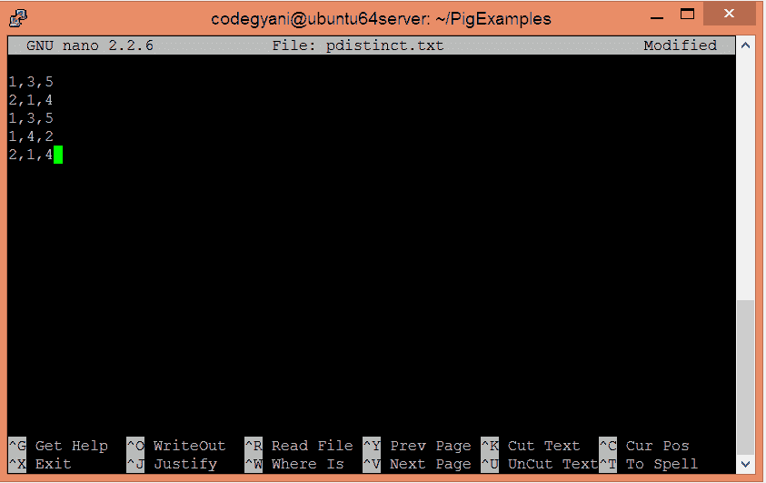
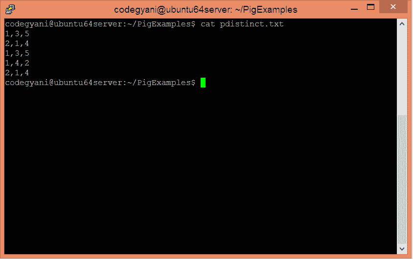
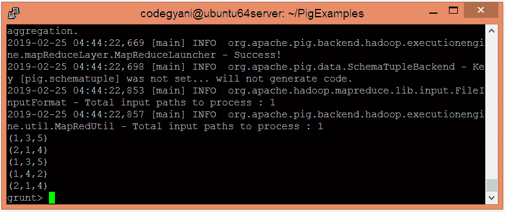
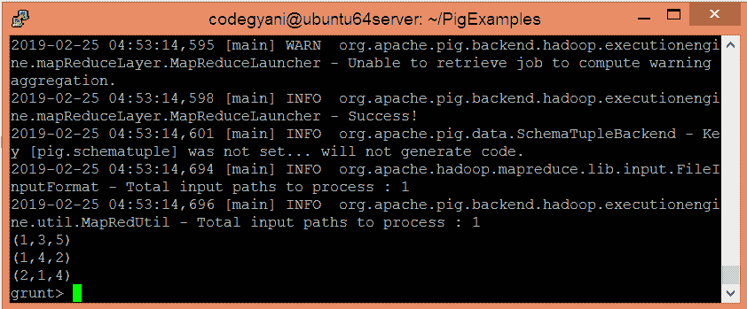

# ApachePig 独特算子

> 原文：<https://www.javatpoint.com/apache-pig-distinct-operator>

Apache Pig DISTINCT 运算符用于移除关系中的重复元组。最初，Pig 对给定的数据进行排序，然后消除重复数据。

## DISTINCT 运算符示例

在这个例子中，我们消除了重复的元组。

### 执行独特运算符的步骤

*   在本地计算机上创建一个文本文件，并为其提供一些值。

```

$ nano pdistinct.txt

```



*   检查文本文件中写入的值。

```

$ cat pdistinct.txt

```



*   将 HDFS 的文本文件上传到特定目录。

```

$ hdfs dfs -put pdistinct.txt /pigexample

```

*   打开 PIG MapReduce 运行模式。

```

$ pig

```

*   加载包含数据的文件。

```

grunt> A = LOAD '/pigexample/pdistinct.txt' USING PigStorage(',') as (a1:int,a2:int,a3:int);

```

*   现在，执行并验证数据。

```

grunt> DUMP A;

```



*   让我们执行 DISTINCT 运算符来消除重复的元组。

```

grunt> Result = DISTINCT A;

```

*   现在，执行并验证数据。

```

grunt> DUMP Result;

```



在这里，我们得到了期望的输出。