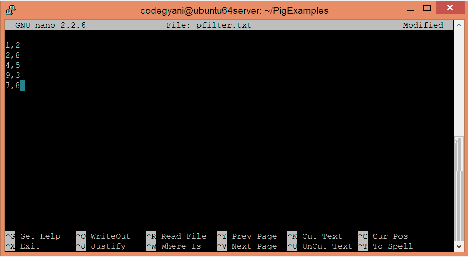
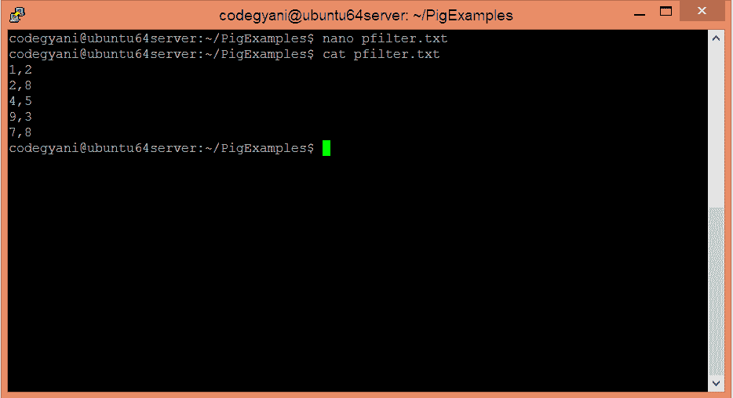
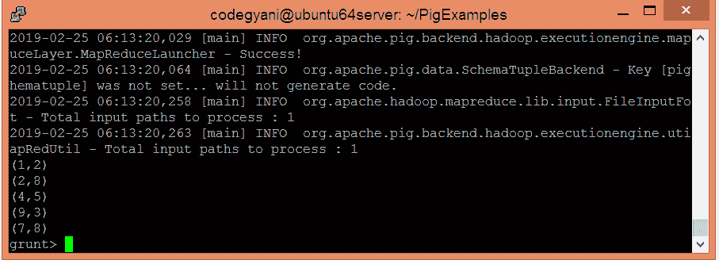
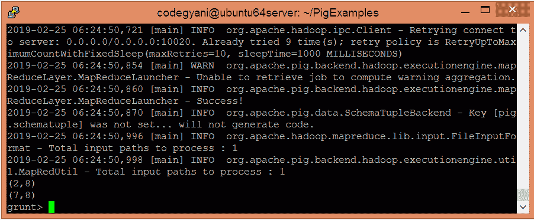

# ApachePig过滤算子

> 原文：<https://www.javatpoint.com/apache-pig-filter-operator>

Apache Pig FILTER 运算符用于移除关系中的重复元组。最初，Pig 对给定的数据进行排序，然后消除重复数据。

## 过滤运算符示例

在这个例子中，我们消除了重复的元组。

### 执行筛选运算符的步骤

*   在本地计算机上创建一个文本文件，并为其提供一些值。

```

$ nano pfilter.txt

```



*   检查文本文件中写入的值。

```

$ cat pfilter.txt

```



*   将 HDFS 的文本文件上传到特定目录。

```

$ hdfs dfs -put pfilter.txt /pigexample

```

*   打开PIG MapReduce 运行模式。

```

$ pig

```

*   加载包含数据的文件。

```

grunt> A = LOAD '/pigexample/pfilter.txt' USING PigStorage(',') AS (a1:int,a2:int);

```

*   现在，执行并验证数据

```

grunt> DUMP A;

```



*   让我们执行 FILTER 运算符来消除重复的元组。

```

grunt> Result = FILTER A BY a2==8;

```

*   现在，执行并验证数据。

```

grunt> DUMP Result;

```



在这里，我们得到了期望的输出。