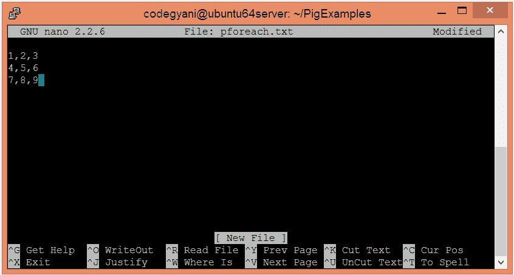
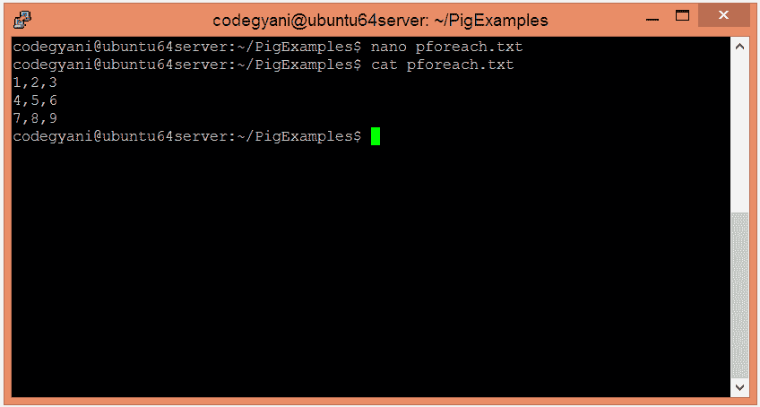
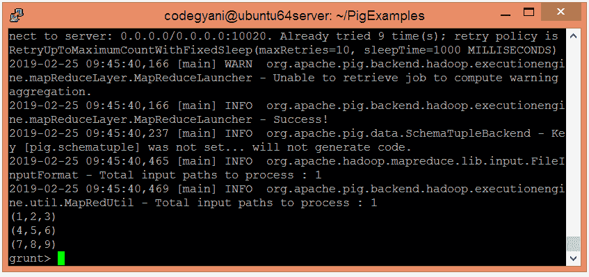
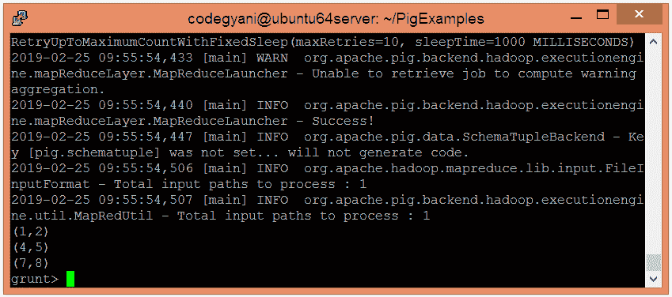

# 阿帕奇猪 FOREACH 算子

> 原文：<https://www.javatpoint.com/apache-pig-foreach-operator>

Apache Pig FOREACH 运算符基于数据列生成数据转换。建议使用 FILTER 操作来处理数据的元组。

## FOREACH 运算符示例

在这个例子中，我们遍历给定文件中存在的两列数据。

### 执行 FOREACH 运算符的步骤

*   在本地计算机上创建一个文本文件，并为其提供一些值。

```

$ nano pforeach.txt

```



*   检查文本文件中写入的值。

```

$ cat pforeach.txt

```



*   将 HDFS 的文本文件上传到特定目录。

```

$ hdfs dfs -put pforeach.txt /pigexample

```

*   打开猪 MapReduce 运行模式。

```

$ pig

```

*   加载包含数据的文件。

```

grunt> A = LOAD '/pigexample/pforeach.txt' USING PigStorage(',') AS (a1:int,a2:int,a3:int) ;

```

*   现在，执行并验证数据。

```

grunt> DUMP A;

```



*   让我们遍历两列的数据。

```

grunt> fe = FOREACH A generate a1,a2;
grunt> DUMP fe;

```



在这里，我们得到了期望的输出。