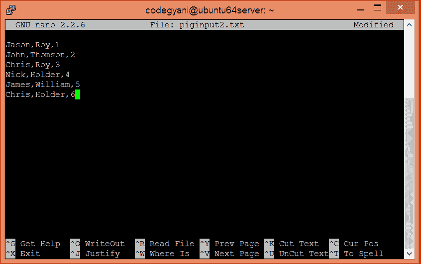
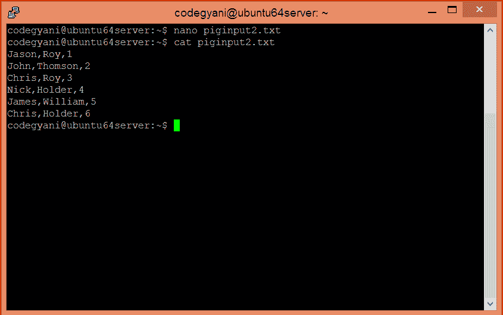
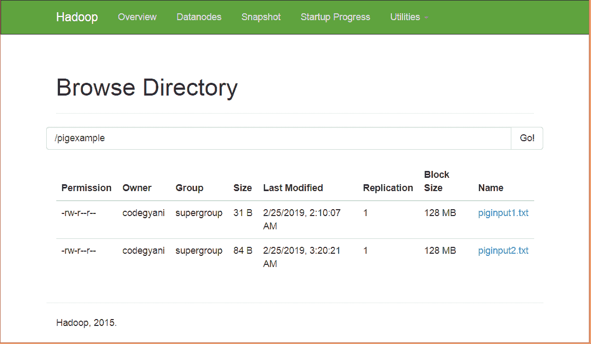
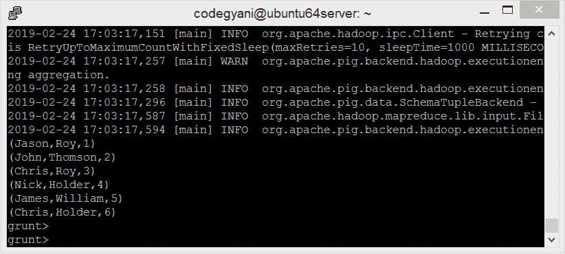
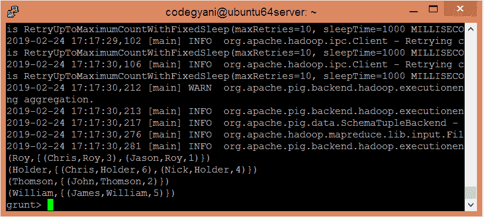

# ApachePig集团运营商

> 原文：<https://www.javatpoint.com/apache-pig-group-operator>

Apache Pig GROUP 运算符用于将一个或多个关系中的数据分组。它对包含相似组键的元组进行分组。如果组键有多个字段，它将被视为元组，否则它将与组键的类型相同。结果，它提供了一个每组包含一个元组的关系。

## 组运算符示例

在本例中，我们根据姓氏对给定的数据进行分组。

### 执行组运算符的步骤

*   在本地机器上创建一个文本文件，并在其中写入一些文本。

```

$ nano piginput2.txt

```



*   检查 piginput2.txt 文件中写入的文本。

```

$ cat piginput2.txt

```



*   将 piginput2.txt 文件上传到 HDFS 的特定目录中。

```

 $ hdfs dfs -put /home/codegyani/piginput2.txt /pigexample

```



*   打开PIG MapReduce 运行模式。

```

$ pig

```

*   将数据装入包中。

```

grunt> A = LOAD '/pigexample/piginput2.txt' USING PigStorage(',') AS (fname:chararray,l_name:chararray,id:int);

```

*   现在执行并验证数据。

```

grunt> DUMP A;

```



*   让我们根据 l_name 对数据进行分组。

```

grunt> groupbylname = group A by l_name ;

```

*   现在，执行并验证数据。

```

grunt> DUMP groupbylname;

```



在这里，我们得到了期望的输出。