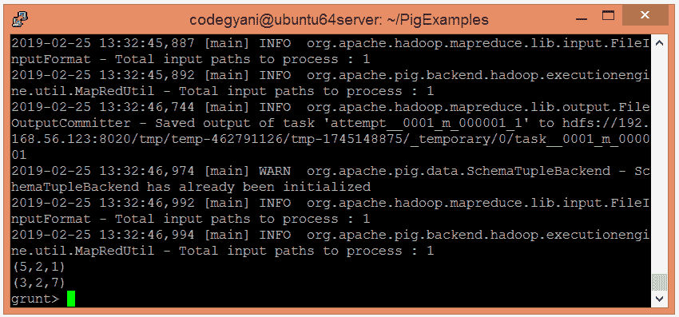

# ApachePig 极限算子

> 原文：<https://www.javatpoint.com/apache-pig-limit-operator>

Apache Pig LIMIT 运算符用于限制输出元组的数量。但是，如果您指定的输出元组的限制等于或大于元组的数量，则会返回关系中的所有元组。

## 极限运算符示例

在这个例子中，我们只返回关系中所有元组中的两个元组。

### 执行极限运算符的步骤

*   在本地机器上创建一个文本文件，并插入元组列表。

```

$ nano plimit.txt

```


*   检查文本文件中插入的元组。

```

$ cat plimit.txt

```


*   将 HDFS 的文本文件上传到特定目录。

```

$ hdfs dfs -put plimit.txt /pigexample

```

*   打开 PIG MapReduce 运行模式。

```

$ pig

```

*   加载包含数据的文件。

```

grunt> A = LOAD '/pigexample/plimit.txt' USING PigStorage(',') AS (a1:int,a2:int,a3:int) ;

```

*   现在，执行并验证数据。

```

grunt> DUMP A;

```


*   让我们返回前两个元组。

```

grunt> Result = LIMIT A 2;
grunt> DUMP Result;

```



在这里，我们得到了期望的输出。