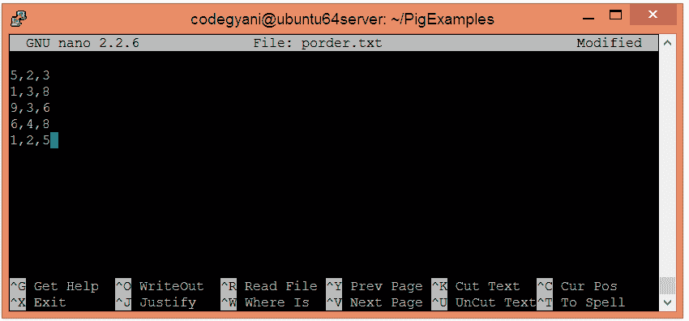
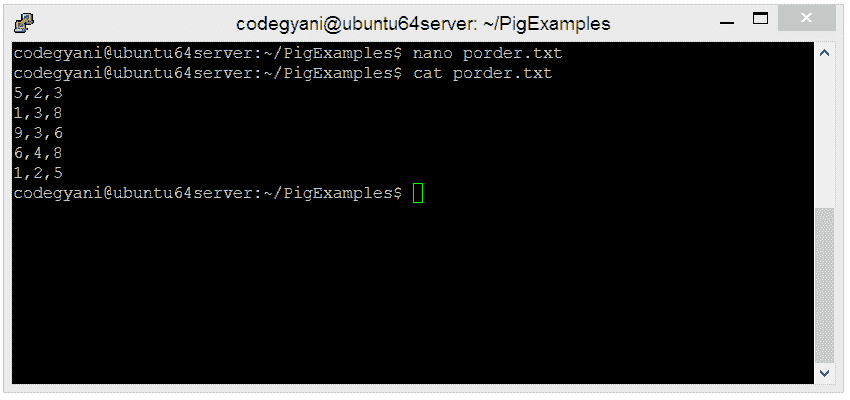
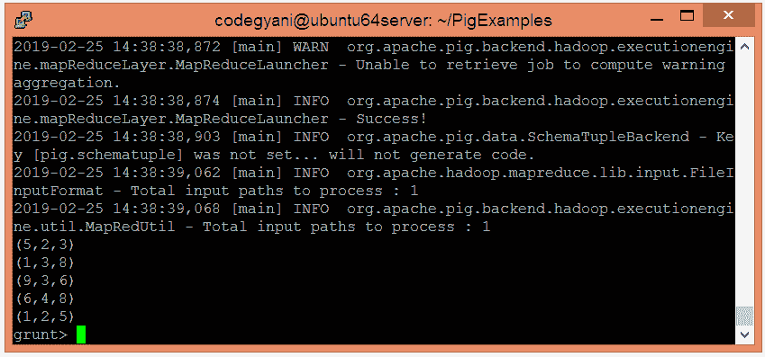
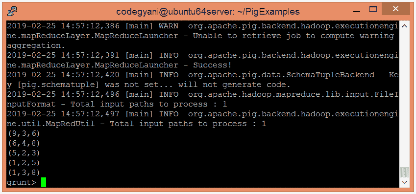

# 按操作员排列的ApachePig订单

> 原文：<https://www.javatpoint.com/apache-pig-order-by-operator>

Apache Pig ORDER BY 运算符基于一个或多个字段对关系进行排序。它维护元组的顺序。

## 按操作员排序的示例

在这个例子中，我们只返回关系中所有元组中的两个元组。

### 按操作员执行订单的步骤

*   在本地机器上创建一个文本文件，并插入元组列表。

```

$ nano porder.txt

```



*   检查文本文件中插入的元组。

```

$ cat porder.txt

```



*   将 HDFS 的文本文件上传到特定目录。

```

$ hdfs dfs -put porder.txt /pigexample

```

*   打开PIG MapReduce 运行模式。

```

$ pig

```

*   加载包含数据的文件。

```

grunt> A = LOAD '/pigexample/porder.txt' USING PigStorage(',') AS (a1:int,a2:int,a3:int) ;

```

*   现在，执行并验证数据。

```

grunt> DUMP A;

```



*   让我们返回前两个元组。

```

grunt> Result = ORDER A BY a1 DESC;
grunt> DUMP Result;

```



在这里，我们得到了期望的输出。