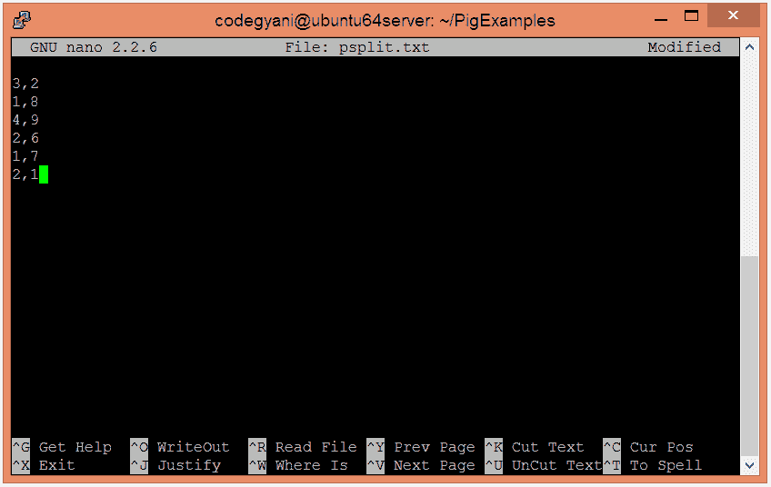
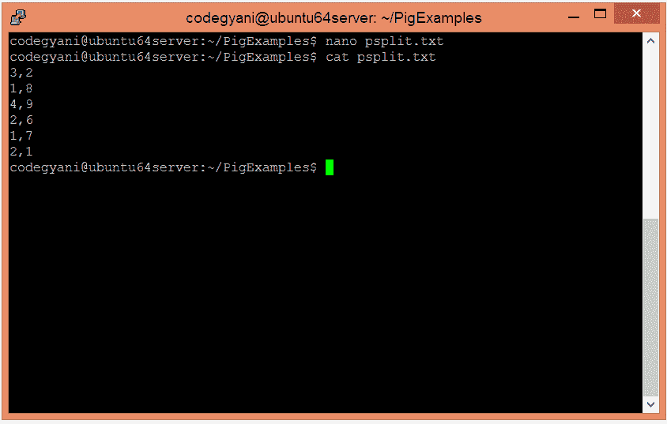
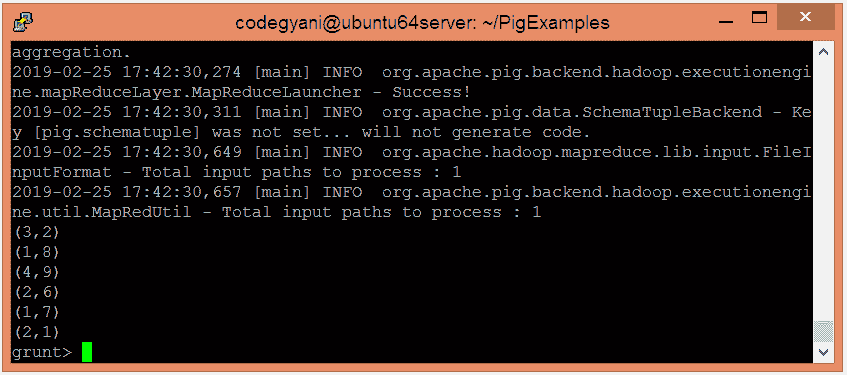
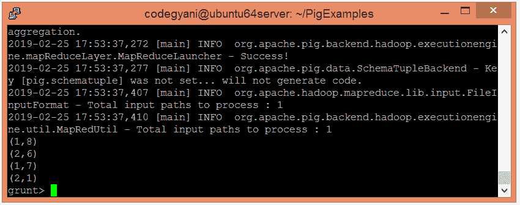
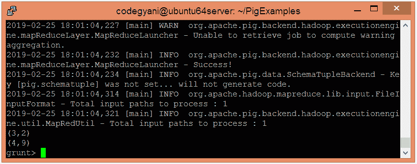

# 阿帕奇猪分裂算子

> 原文：<https://www.javatpoint.com/apache-pig-split-operator>

Apache Pig SPLIT 运算符根据提供的表达式将关系分成两个或多个关系。这里，元组可以或可以不被分配给一个或多个关系。

## 拆分运算符示例

在这个例子中，我们将提供的关系分成两个关系。

### 执行拆分运算符的步骤

*   在本地计算机上创建一个文本文件，并为其提供一些值。

```

$ nano psplit.txt

```



*   检查文本文件中写入的值。

```

$ cat psplit.txt

```



*   将 HDFS 的文本文件上传到特定目录。

```

$ hdfs dfs -put psplit.txt /pigexample

```

*   打开猪 MapReduce 运行模式。

```

$ pig

```

*   加载包含数据的文件。

```

grunt> A = LOAD '/pigexample/psplit.txt' USING PigStorage(',') AS (a1:int,a2:int) ;

```

*   现在，执行并验证数据。

```

grunt> DUMP A;

```



*   让我们提供表达式来分割关系。

```

grunt> SPLIT A INTO X IF a1<=2, Y IF a1>2;

```



*   现在，执行并验证第一个关系的数据。

```

grunt> DUMP X;

```


*   现在，执行并验证第二个关系的数据。

```

grunt> DUMP Y;

```



在这里，我们得到了期望的输出。