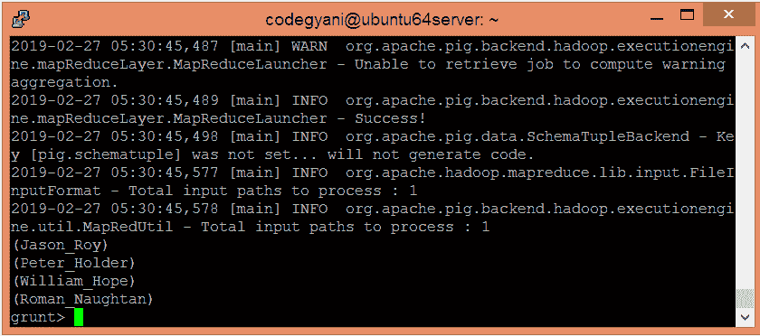

# 阿帕奇猪 CONCAT 函数

> 原文：<https://www.javatpoint.com/apache-pig-concat-function>

Apache Pig CONCAT 函数用于连接两个或多个表达式。表达式的生成结果必须具有相同的类型。但是，如果任何子表达式为空，则生成的表达式也为空。

## CONCAT 函数示例

在这个例子中，我们连接每个元组的前两个字段。

### 执行 CONCAT 函数的步骤

*   在本地机器上创建一个文本文件，并插入元组列表。

```

$ nano evalconcat.txt

```


*   检查文本文件中插入的元组。

```

$ cat evalconcat.txt

```


*   将 HDFS 的文本文件上传到特定目录。

```

$ hdfs dfs -put evalconcat.txt /pigexample

```

*   打开猪 MapReduce 运行模式。

```

$ pig

```

*   加载包含数据的文件。

```

grunt> A = LOAD '/pigexample/evalconcat.txt' USING PigStorage(',') AS (a1:chararray,a2:chararray,a3:int);

```

*   现在，执行并验证数据。

```

grunt> DUMP A;

```


*   让我们返回每个元组的两个字段的串联。

```

Result = FOREACH A GENERATE CONCAT (a1,'_',a2); 
DUMP Result;

```



在这里，我们得到了期望的输出。