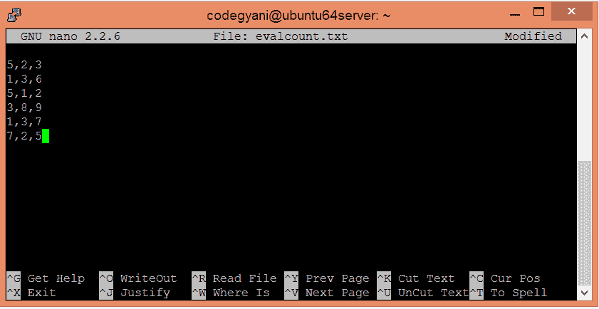
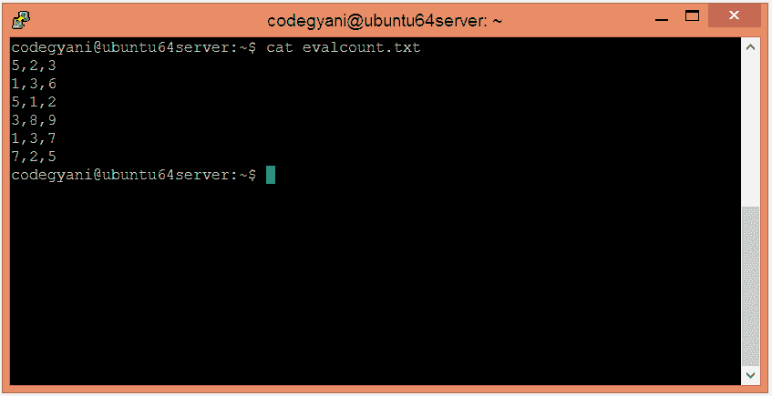
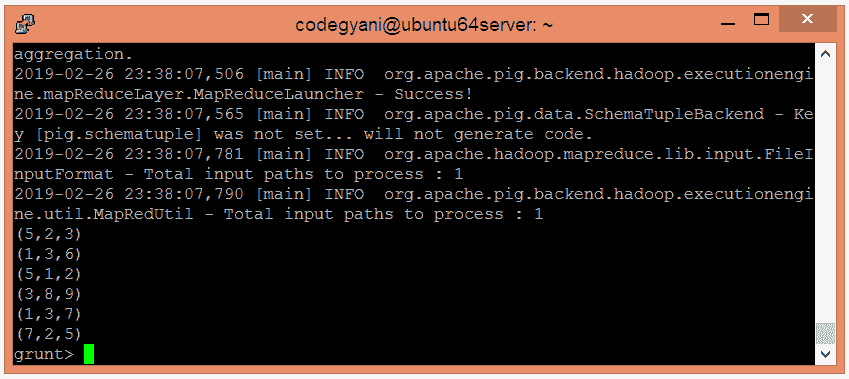
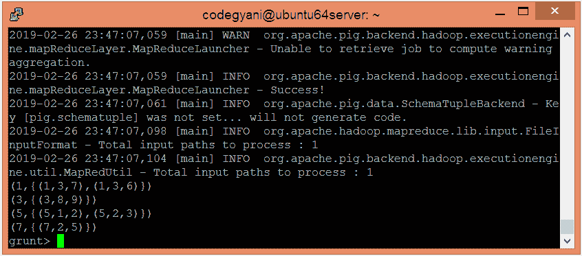
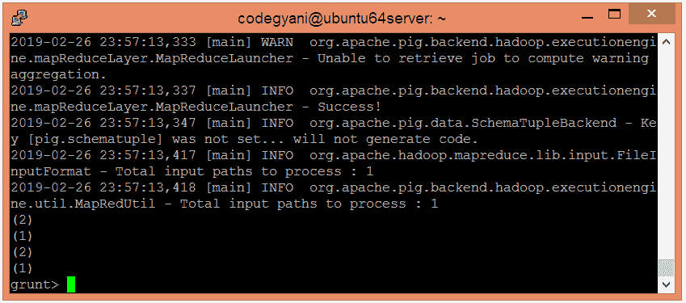

# 阿帕奇猪计数函数

> 原文：<https://www.javatpoint.com/apache-pig-count-function>

Apache Pig COUNT 函数用于计算包中元素的数量。对于全局计数，它需要一个前面的 GROUP ALL 语句，对于组计数，它需要一个 GROUP BY 语句。它忽略空值。

## 计数函数示例

在这个例子中，我们计算包中的元组。

### 执行计数功能的步骤

*   在本地机器上创建一个文本文件，并插入元组列表。

```

$ nano evalcount.txt

```



*   检查文本文件中插入的元组。

```

$ cat evalcount.txt

```



*   将 HDFS 的文本文件上传到特定目录。

```

$ hdfs dfs -put evalcount.txt /pigexample

```

*   打开猪 MapReduce 运行模式。

```

$ pig

```

*   加载包含数据的文件。

```

grunt> A = LOAD '/pigexample/evalcount.txt' USING PigStorage(',') AS (a1:int,a2:int,a3:int) ;

```

*   现在，执行并验证数据。

```

grunt> DUMP A;

```



*   让我们根据“a1”字段对数据进行分组。

```

grunt> B = GROUP A BY a1; 
grunt> DUMP B;

```



*   让我们返回给定元组的计数。

```

grunt> Result = FOREACH B GENERATE COUNT(A);
grunt> DUMP Result;

```



在这里，我们得到了期望的输出。