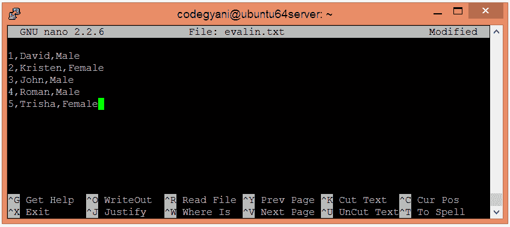
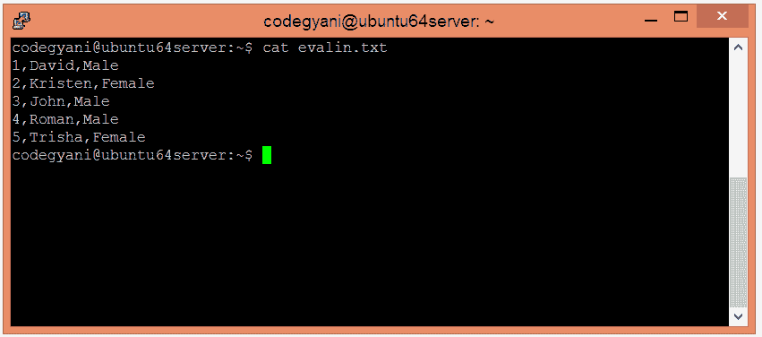
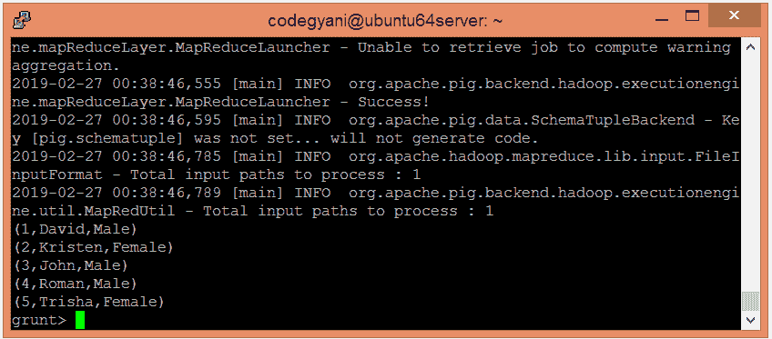
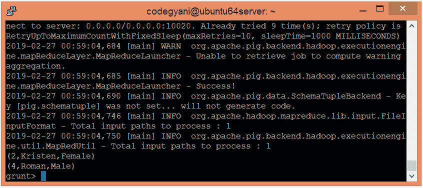

# ApachePig函数

> 原文：<https://www.javatpoint.com/apache-pig-in-function>

ApachePig输入功能用于降低对多个或条件的要求。它便于检查当前表达式是否与列表中存在的任何值匹配。

## 输入函数示例

在这个例子中，我们通过对列表的值应用 In 运算符来过滤元组。

### 执行输入功能的步骤

*   在本地机器上创建一个文本文件，并插入元组列表。

```

$ nano evalin.txt

```



*   检查文本文件中插入的元组。

```

$ cat evalin.txt

```



*   将 HDFS 的文本文件上传到特定目录。

```

$ hdfs dfs -put evalin.txt /pigexample

```

*   打开PIG MapReduce 运行模式。

```

$ pig

```

*   加载包含数据的文件。

```

grunt> A = LOAD '/pigexample/evalin.txt' USING PigStorage(',') AS (a1:int,a2:chararray,a3:chararray) ;

```

*   现在，执行并验证数据。

```

grunt> DUMP A;

```



*   让我们返回文件服务器数据。

```

grunt> Result = FILTER A BY a1 IN (2, 4);
grunt> DUMP Result;

```



在这里，我们得到了期望的输出。