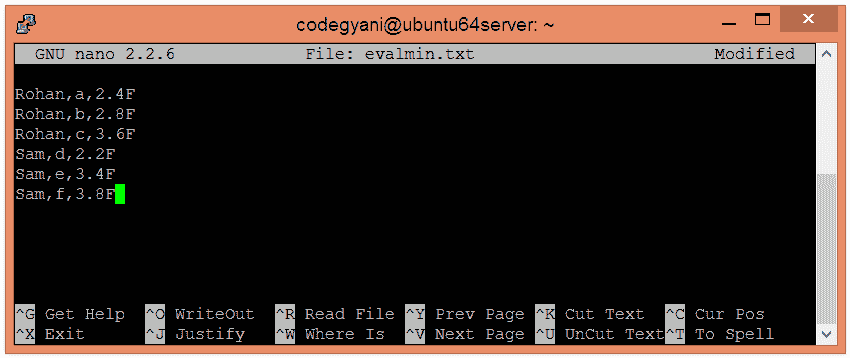
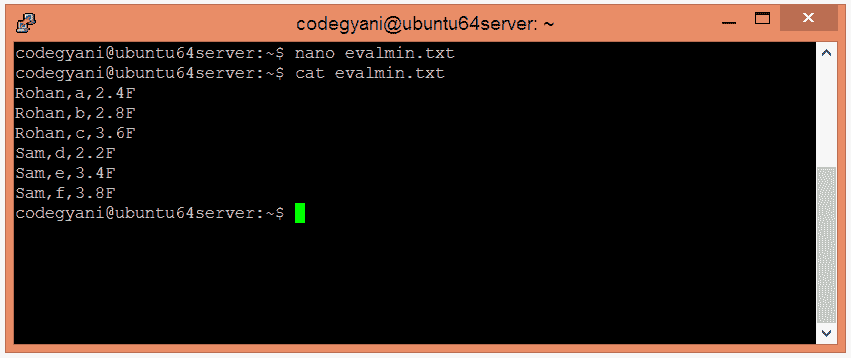
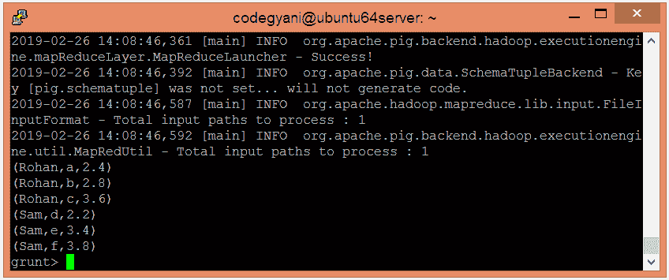
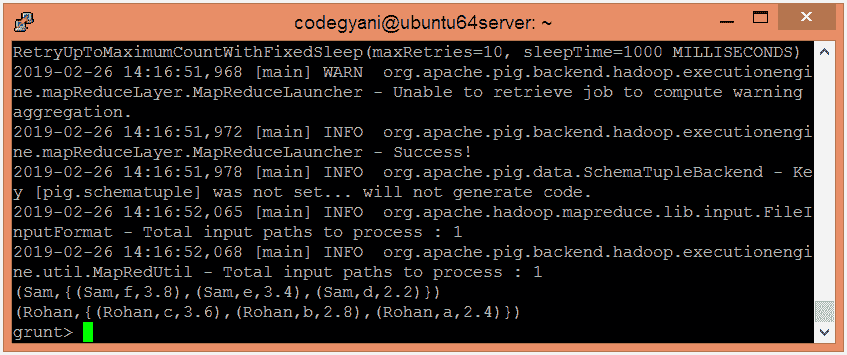
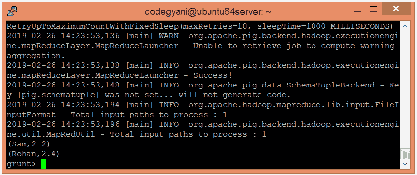

# ApachePig 最小函数

> 原文：<https://www.javatpoint.com/apache-pig-min-function>

Apache Pig MIN 函数用于找出单列袋中数值或字符的最小值。对于全局最小值，它需要一个前面的 GROUP ALL 语句，对于组最小值，它需要一个 GROUP BY 语句。但是，它忽略空值。

### 句法

```

MIN(exp)

```

在这里，

**exp** -它是一个带有 chararray、int、float、long 等数据类型的表达式。

## 最小函数示例

在这个例子中，我们将找出给定值的最小值。

### 执行最小函数的步骤

*   在本地机器上创建一个文本文件，并插入元组列表。

```

$ nano evalmin.txt

```



*   检查文本文件中插入的元组。

```

$ cat evalmin.txt

```



*   将 HDFS 的文本文件上传到特定目录。

```

$ hdfs dfs -put evalmin.txt /pigexample

```

*   打开 PIG MapReduce 运行模式。

```

$ pig

```

*   加载包含数据的文件。

```

grunt> A = LOAD '/pigexample/evalmin.txt' USING PigStorage(',') AS (a1:chararray,a2:chararray,a3:float) ;

```

*   现在，执行并验证数据。

```

grunt> DUMP A;

```



*   让我们根据“a1”字段对数据进行分组。

```

grunt> B = GROUP A BY a1; 
grunt> DUMP B;

```



*   让我们返回给定数值的最小值。

```

grunt> Result = FOREACH B GENERATE group, MIN(A.a3);
grunt> DUMP Result;

```



在这里，我们得到了期望的输出。