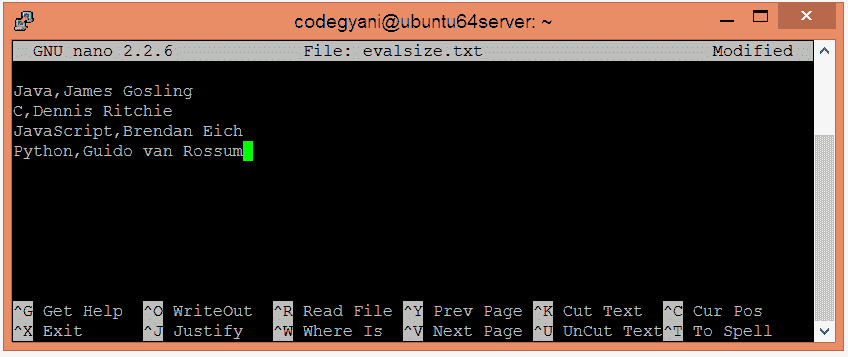
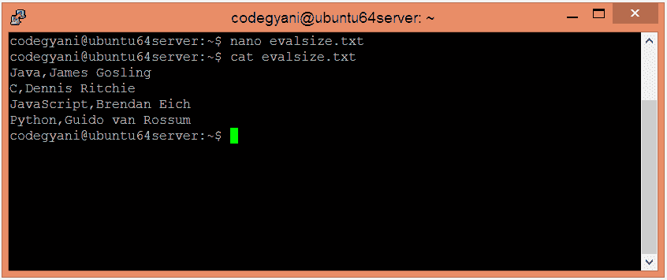
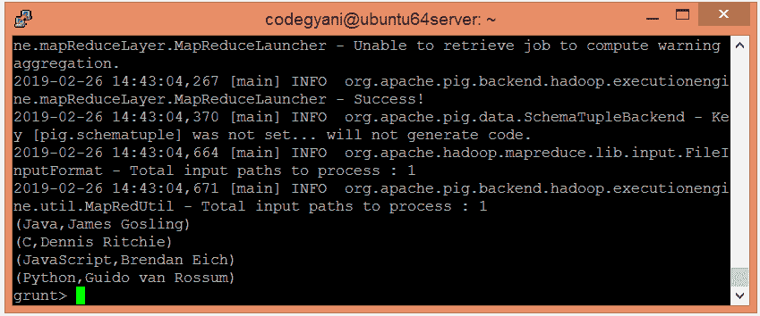
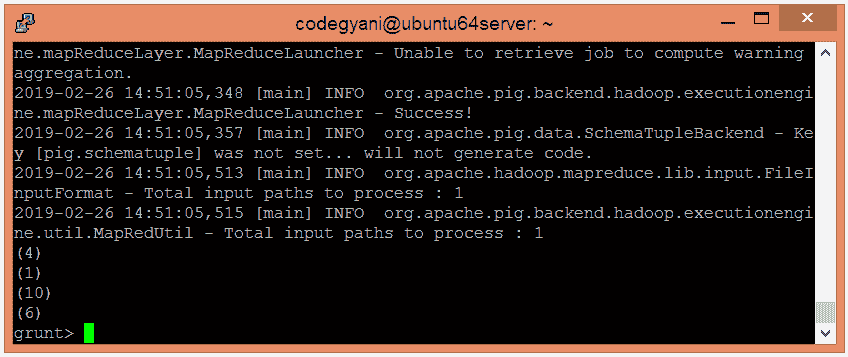

# 阿帕奇猪大小函数

> 原文：<https://www.javatpoint.com/apache-pig-size-function>

Apache Pig SIZE 函数用于根据任何 Pig 数据类型查找元素数量。它在大小计算中包含空值。这里，大小不是代数的。

## 尺寸函数示例

在这个例子中，我们计算每个元组的第一个字段中的字符数。

### 执行尺寸函数的步骤

*   在本地机器上创建一个文本文件，并插入元组列表。

```

$ nano evalsize.txt

```



*   检查文本文件中插入的元组。

```

$ cat evalsize.txt

```



*   将 HDFS 的文本文件上传到特定目录。

```

$ hdfs dfs -put evalsize.txt /pigexample

```

*   打开猪 MapReduce 运行模式。

```

$ pig

```

*   加载包含数据的文件。

```

grunt> A = LOAD '/pigexample/evalsize.txt' USING PigStorage(',') AS (a1:chararray,a2:chararray) ;

```

*   现在，执行并验证数据。

```

grunt> DUMP A;

```



*   让我们返回每个元组的第一个字段的大小。

```

grunt> Result = FOREACH A GENERATE SIZE(a1);
grunt> DUMP Result;

```



在这里，我们得到了期望的输出。