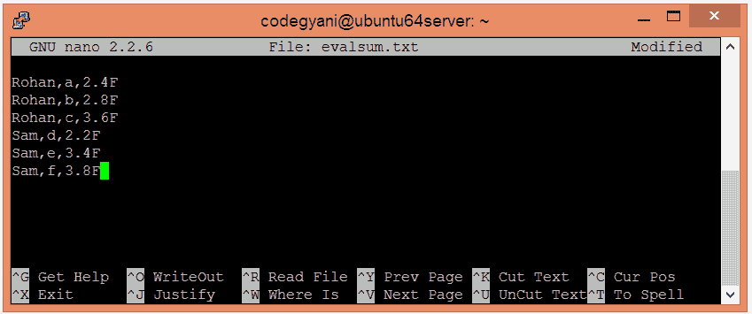
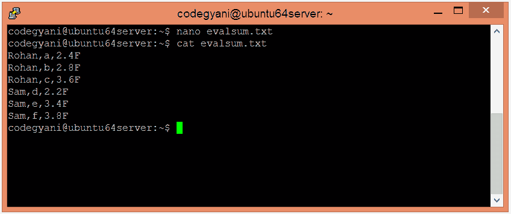
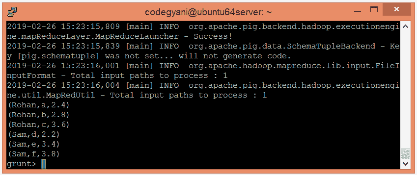
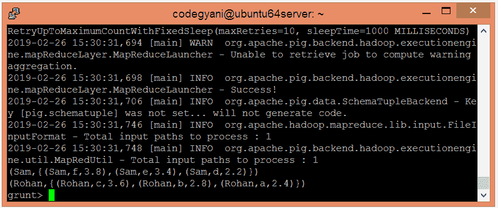
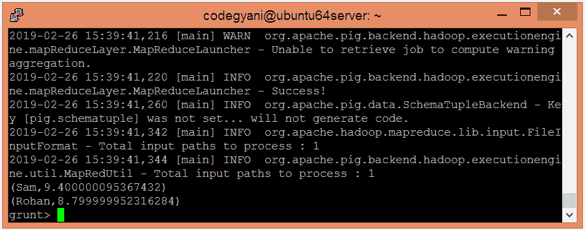

# ApachePig求和函数

> 原文：<https://www.javatpoint.com/apache-pig-sum-function>

Apache Pig SUM 函数用于查找单列包中数值的总和。它要求全局和的前面有一个 GROUP ALL 语句，组和的前面有一个 GROUP BY 语句。它忽略空值。

## 求和函数示例

在这个例子中，我们计算给定数值的总和。

### 执行求和函数的步骤

*   在本地机器上创建一个文本文件，并插入元组列表。

```

$ nano evalsum.txt

```



*   检查文本文件中插入的元组。

```

$ cat evalsum.txt

```



*   将 HDFS 的文本文件上传到特定目录。

```

$ hdfs dfs -put evalsum.txt /pigexample

```

*   打开PIG MapReduce 运行模式。

```

$ pig

```

*   加载包含数据的文件。

```

grunt> A = LOAD '/pigexample/evalsum.txt' USING PigStorage(',') AS (a1:chararray,a2:chararray,a3:float) ;

```

*   现在，执行并验证数据。

```

grunt> DUMP A;

```



*   让我们根据“a1”字段对数据进行分组。

```

grunt> B = GROUP A BY a1; 
grunt> DUMP B;

```



*   让我们返回给定数值的总和。

```

grunt> Result = FOREACH B GENERATE group, SUM(A.a3);
grunt> DUMP Result;

```



在这里，我们得到了期望的输出。