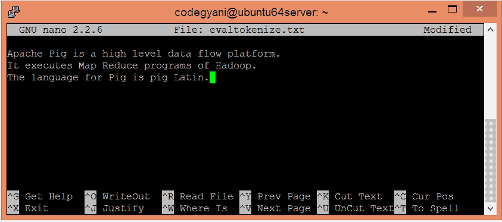
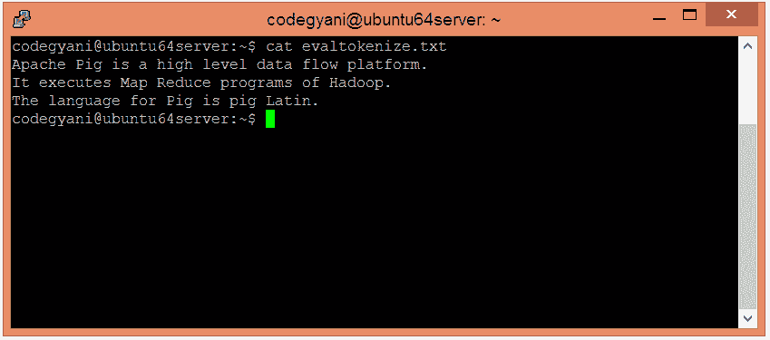
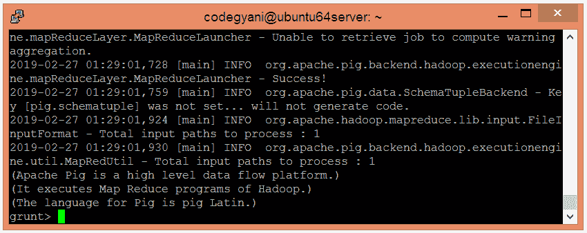
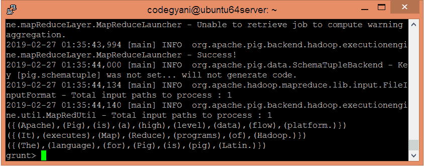

# ApachePig令牌化函数

> 原文：<https://www.javatpoint.com/apache-pig-tokenize-function>

Apache Pig TOKENIZE 函数用于拆分现有字符串，并在结果中生成一包单词。

## 令牌化函数示例

在本例中，我们将字符串拆分为标记。

### 执行令牌化函数的步骤

*   在本地机器上创建一个文本文件，并插入元组列表。

```

$ nano evaltokenize.txt 

```



*   检查文本文件中插入的元组。

```

$ cat evaltokenize.txt

```



*   将 HDFS 的文本文件上传到特定目录。

```

$ hdfs dfs -put evaltokenize.txt /pigexample

```

*   打开PIG MapReduce 运行模式。

```

$ pig

```

*   加载包含数据的文件。

```

grunt> A = LOAD '/pigexample/evaltokenize.txt' USING PigStorage(',') AS (a1:chararray) ;

```

*   现在，执行并验证数据。

```

grunt> DUMP A;

```



*   让我们返回字符串的标记化形式。

```

grunt> Result = FOREACH A GENERATE TOKENIZE(a1);
grunt> DUMP Result;

```



在这里，我们得到了期望的输出。