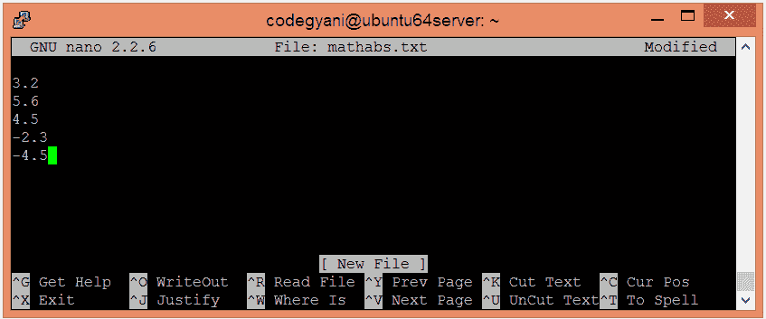
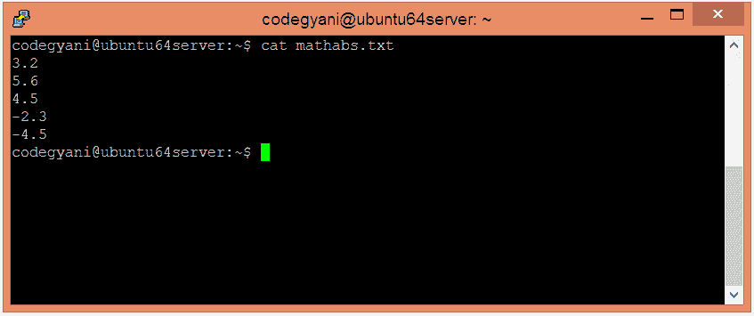
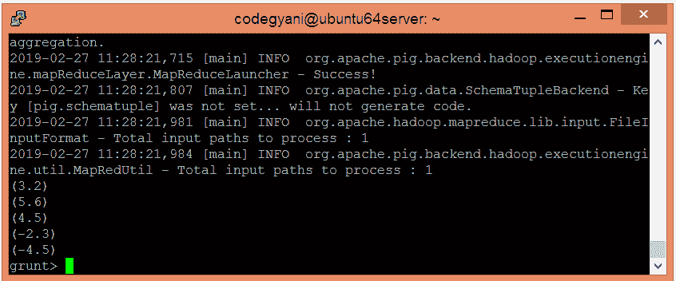
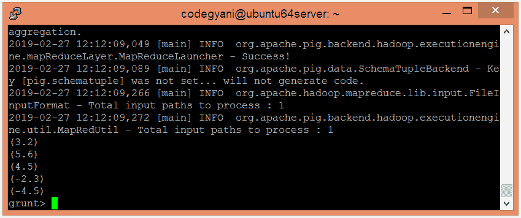

# 阿帕奇猪腹肌功能

> 原文：<https://www.javatpoint.com/apache-pig-abs-function>

Apache Pig ABS 函数用于返回表达式的绝对值。如果结果是否定的，则返回结果的否定。

### 句法

```

ABS(expression)

```

## 防抱死制动系统功能示例

在这个例子中，我们返回绝对值。

### 执行防抱死制动系统功能的步骤

*   在本地计算机上创建一个文本文件，并插入这些值。

```

$ nano mathabs.txt

```



*   检查文本文件中插入的值。

```

$ cat mathabs.txt

```



*   将 HDFS 的文本文件上传到特定目录。

```

$ hdfs dfs -put mathabs.txt /pigexample

```

*   打开猪 MapReduce 运行模式。

```

$ pig

```

*   加载包含数据的文件。

```

grunt> A = LOAD '/pigexample/mathabs.txt' AS (a1:float) ;

```

*   现在，执行并验证数据。

```

grunt> DUMP A;

```



*   让我们返回绝对值。

```

grunt> Result = FOREACH A GENERATE ABS(a1);
grunt> DUMP Result;

```



在这里，我们得到了期望的输出。