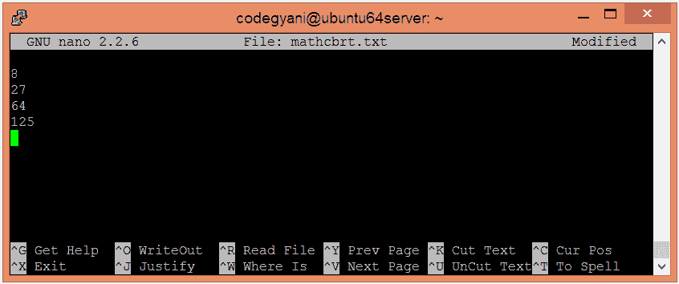
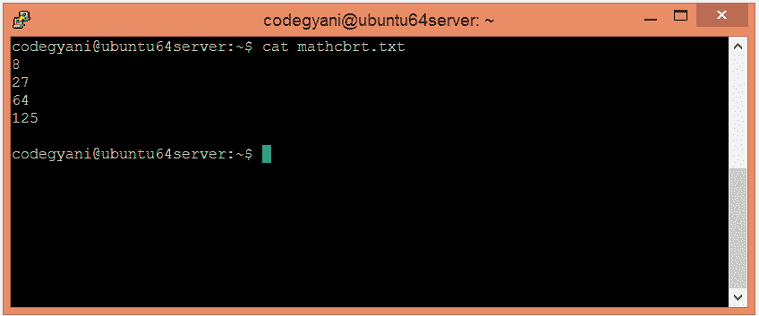
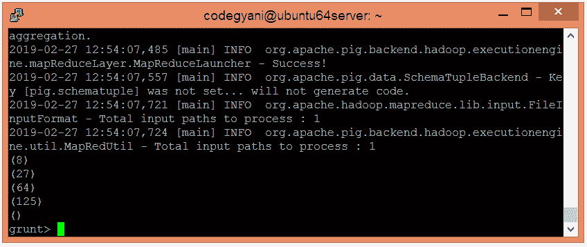
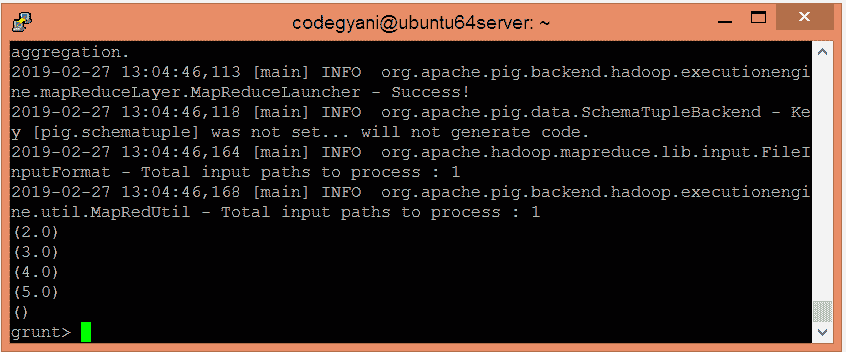

# 阿帕奇猪 CBRT 函数

> 原文：<https://www.javatpoint.com/apache-pig-cbrt-function>

Apache Pig CBRT 函数用于返回表达式的立方根。

### 句法

```

CBRT(expression)

```

## CBRT 函数的例子

在这个例子中，我们找出给定值的立方根。

### 执行 CBRT 函数的步骤

*   在本地计算机上创建一个文本文件，并插入这些值。

```

$ nano mathcbrt.txt

```



*   检查文本文件中插入的值。

```

$ cat mathcbrt.txt

```



*   将 HDFS 的文本文件上传到特定目录。

```

$ hdfs dfs -put mathcbrt.txt /pigexample

```

*   打开猪 MapReduce 运行模式。

```

$ pig

```

*   加载包含数据的文件。

```

 grunt> A = LOAD '/pigexample/mathcbrt.txt' AS (a1:int) ;

```

*   现在，执行并验证数据。

```

grunt> DUMP A;

```



*   让我们返回每个值的立方根。

```

grunt> Result = FOREACH A GENERATE CBRT(a1);
grunt> DUMP Result;

```



在这里，我们得到了期望的输出。