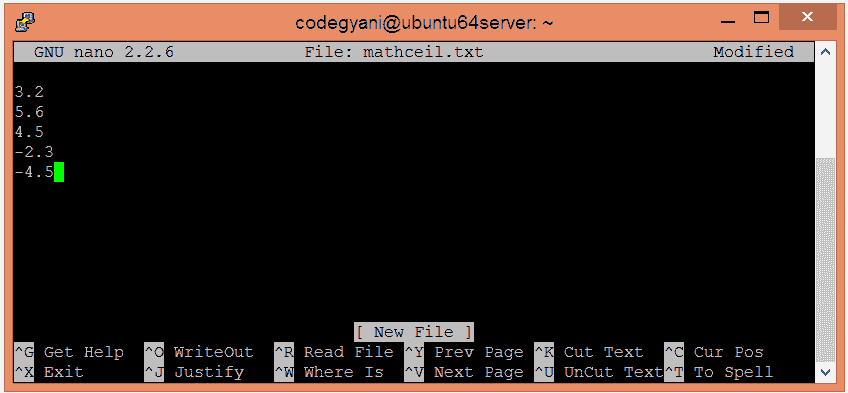
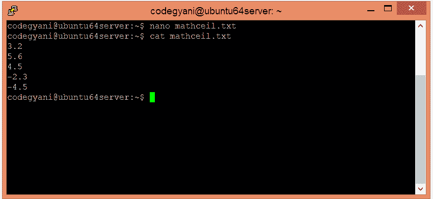
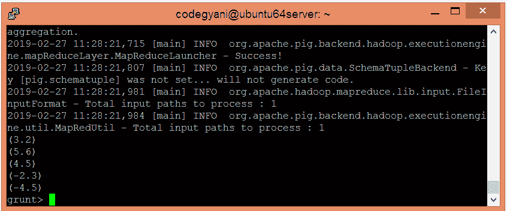
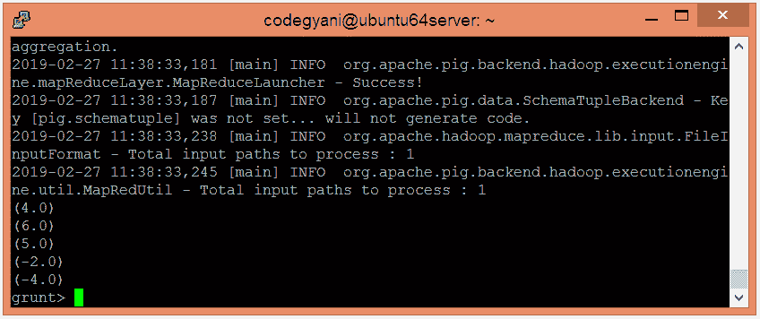

# ApachePig天花板函数

> 原文：<https://www.javatpoint.com/apache-pig-ceil-function>

Apache Pig CEIL 函数用于将提供的值向上舍入到最接近的整数。它返回大于或等于给定值的最小整数。

### 句法

```

CEIL(expression)

```

## 天花板功能示例

在本例中，我们将文件中存在的每个值四舍五入为最接近的整数。

### 执行天花板功能的步骤

*   在本地计算机上创建一个文本文件，并插入这些值。

```

$ nano mathceil.txt

```



*   检查文本文件中插入的值。

```

$ cat mathceil.txt

```



*   将 HDFS 的文本文件上传到特定目录。

```

$ hdfs dfs -put mathceil.txt /pigexample

```

*   打开PIG MapReduce 运行模式。

```

$ pig

```

*   加载包含数据的文件。

```

grunt> A = LOAD '/pigexample/mathceil.txt' AS (a1:float) ;

```

*   现在，执行并验证数据。

```

grunt> DUMP A;

```



*   让我们对文本文件中存在的所有值进行舍入。

```

grunt> Result = FOREACH A GENERATE CEIL(a1);
grunt> DUMP Result;

```



在这里，我们得到了期望的输出。