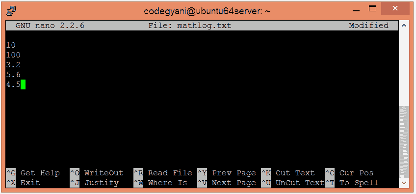
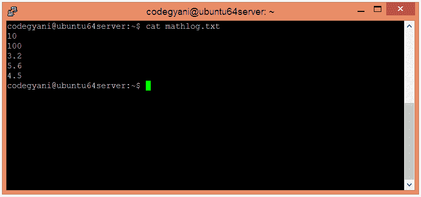
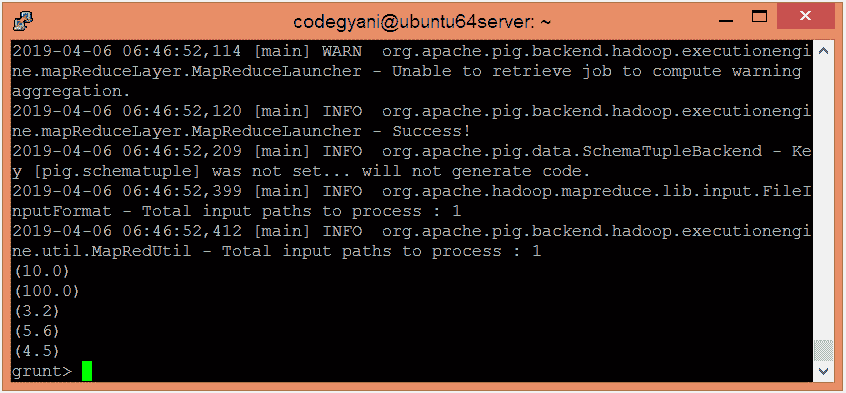
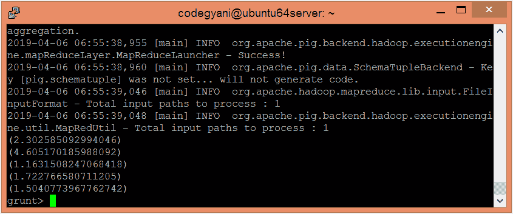

# ApachePig 日志函数

> 原文：<https://www.javatpoint.com/apache-pig-log-function>

Apache Pig LOG 函数用于返回表达式的自然对数(以 e 为底)。

### 句法

```

LOG(expression)

```

## 日志功能示例

在这个例子中，我们返回日志值。

### 执行日志功能的步骤

*   在本地计算机上创建一个文本文件，并插入这些值。

```

$ nano mathlog.txt

```



*   检查文本文件中插入的值。

```

$ cat mathlog.txt

```



*   将 HDFS 的文本文件上传到特定目录。

```

$ hdfs dfs -put mathlog.txt /pigexample

```

*   打开 PIG MapReduce 运行模式。

```

$ pig

```

*   加载包含数据的文件。

```

grunt> A = LOAD '/pigexample/mathlog.txt' AS (a1:float) ;

```

*   现在，执行并验证数据。

```

grunt> DUMP A;

```



*   让我们返回日志值。

```

grunt> Result = FOREACH A GENERATE LOG(a1);
grunt> DUMP Result;

```



在这里，我们得到了期望的输出。