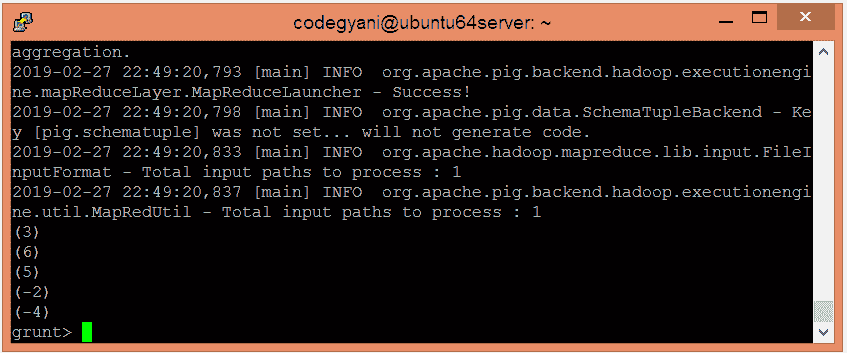

# ApachePig圆函数

> 原文：<https://www.javatpoint.com/apache-pig-round-function>

Apache Pig ROUND 函数用于将提供的值向上舍入为整数。如果返回类型为 float，则该值四舍五入为整数。但是，如果返回类型是 double，则该值四舍五入为 long。

### 句法

```

ROUND(expression)

```

## 舍入函数示例

在本例中，我们返回给定表达式的舍入值。

### 执行舍入函数的步骤

*   在本地计算机上创建一个文本文件，并插入这些值。

```

$ nano mathround.txt

```


*   检查文本文件中插入的值。

```

$ cat mathround.txt

```


*   将 HDFS 的文本文件上传到特定目录。

```

$ hdfs dfs -put mathround.txt /pigexample

```

*   打开PIG MapReduce 运行模式。

```

$ pig

```

*   加载包含数据的文件。

```

grunt> A = LOAD '/pigexample/mathround.txt' AS (a1:float) ;

```

*   现在，执行并验证数据。

```

grunt> DUMP A;

```


*   让我们返回舍入值。

```

grunt> Result = FOREACH A GENERATE ROUND(a1);
grunt> DUMP Result;

```



在这里，我们得到了期望的输出。