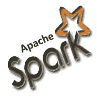

# ApacheSpark教程

> 原文：<https://www.javatpoint.com/apache-spark-tutorial>

Apache Spark 教程提供了 Spark 的基本和高级概念。我们的 Spark 教程是为初学者和专业人士设计的。

Spark 是用于大规模数据处理的统一分析引擎，包括用于 SQL、流、机器学习和图形处理的内置模块。

我们的 Spark 教程包括 Apache Spark 的所有主题，包括 Spark 简介、Spark 安装、Spark 架构、Spark 组件、RDD、Spark 实时示例等。

## 先决条件

在学习 Spark 之前，你必须对 Hadoop 有一个基本的了解。

## 观众

我们的 Spark 教程旨在帮助初学者和专业人士。

## 问题

我们向您保证，您不会发现本 Spark 教程有任何问题。但是，如果有任何错误，请在联系表格中发布问题。

* * *