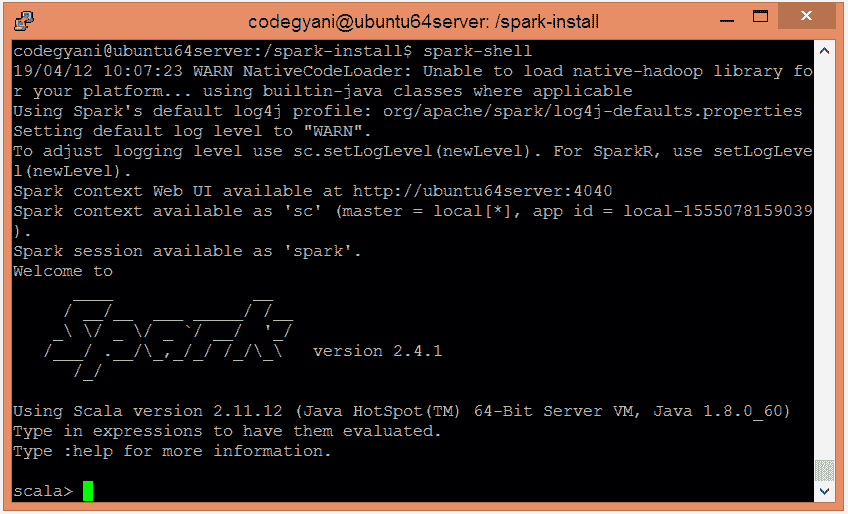

# Spark 安装

> 原文：<https://www.javatpoint.com/apache-spark-installation>

在本节中，我们将安装 Spark。因此，请遵循以下步骤。

*   下载 Apache Spark tar 文件。[点击此处](https://www.apache.org/dyn/closer.lua/spark/spark-2.4.1/spark-2.4.1-bin-hadoop2.7.tgz)
*   解压下载的 tar 文件。

```

sudo tar -xzvf /home/codegyani/spark-2.4.1-bin-hadoop2.7.tgz 

```

*   打开 bashrc 文件。

```

sudo nano ~/.bashrc

```

*   现在，在最后复制下面的 Spark 路径。

```

SPARK_HOME=/ home/codegyani /spark-2.4.1-bin-hadoop2.7
export PATH=$SPARK_HOME/bin:$PATH

```

*   更新环境变量

```

source ~/.bashrc

```

*   让我们在命令提示符下测试安装

```

spark-shell

```



#### 注意——这里，Spark 是在 Scala 模式下启用的。

* * *