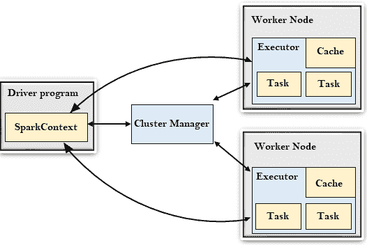

# Spark 建筑

> 原文：<https://www.javatpoint.com/apache-spark-architecture>

Spark 遵循主从架构。它的集群由一个主节点和多个从节点组成。

Spark 架构依赖于两个抽象:

*   弹性分布式数据集(RDD)
*   有向无环图

## 弹性分布式数据集(RDD)

弹性分布式数据集是可以存储在工作节点内存中的一组数据项。在这里，

*   弹性:故障时恢复数据。
*   分布式:数据分布在不同的节点上。
*   数据集:一组数据。

稍后我们将详细了解 RDD。

## 有向无环图

有向无环图是对数据执行一系列计算的有限有向图。每个节点都是一个 RDD 分区，边缘是数据之上的转换。这里，图指的是导航，而有向和无向指的是导航是如何完成的。

让我们了解一下 Spark 架构。

## 驱动程序

驱动程序是运行应用程序的 main()函数并创建 **SparkContext** 对象的过程。 **SparkContext** 的目的是协调 spark 应用程序，作为集群上独立的进程集运行。

要在集群上运行， **SparkContext** 连接到不同类型的集群管理器，然后执行以下任务:-

*   它获取集群中节点上的执行器。
*   然后，它将您的应用程序代码发送给执行者。这里，应用程序代码可以由传递给 SparkContext 的 JAR 或 Python 文件来定义。
*   最后，SparkContext 将任务发送给执行者运行。

## 集群管理器

*   集群管理器的作用是跨应用程序分配资源。Spark 能够在大量集群上运行。
*   它由各种类型的集群管理器组成，如 Hadoop 纱、Apache Mesos 和独立调度器。
*   这里，独立调度程序是一个独立的 Spark 集群管理器，便于在一组空机器上安装 Spark。

### 工作节点

*   工作节点是从节点
*   它的作用是在集群中运行应用程序代码。

### 执行者

*   执行器是为工作节点上的应用程序启动的进程。
*   它运行任务并将数据保存在内存或磁盘存储器中。
*   它向外部源读写数据。
*   每个应用程序都包含它的执行器。

### 工作

*   将被发送给一个执行者的工作单位。

* * *