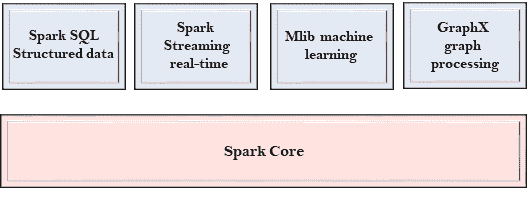

# Spark组件

> 原文：<https://www.javatpoint.com/apache-spark-components>

Spark 项目由不同类型的紧密集成组件组成。Spark 的核心是一个计算引擎，可以调度、分发和监控多个应用程序。

让我们详细了解每个 Spark 组件。

## Spark芯

*   Spark核心是Spark的核心，执行核心功能。
*   它包含任务调度、故障恢复、与存储系统交互和内存管理的组件。

## Spark SQL

*   Spark SQL 建立在Spark核心之上。它为结构化数据提供支持。
*   它允许通过 SQL(结构化查询语言)以及 SQL 的 Apache Hive 变体来查询数据？叫做 HQL(Hive查询语言)。
*   它支持 JDBC 和 ODBC 连接，在 Java 对象和现有数据库、数据仓库和商业智能工具之间建立关系。
*   它还支持各种数据源，如 Hive 表、Parquet 和 JSON。

## Spark流

*   Spark Streaming 是一个 Spark 组件，支持流数据的可扩展和容错处理。
*   它使用 Spark Core 的快速调度功能来执行流分析。
*   它以小批量接受数据，并对该数据执行 RDD 变换。
*   它的设计确保了为流数据编写的应用程序可以在很少修改的情况下被重用来分析成批的历史数据。
*   web 服务器生成的日志文件可以被视为数据流的实时示例。

## MLlib(密西西比州)

*   MLlib 是一个机器学习库，包含各种机器学习算法。
*   这些包括相关性和假设检验、分类和回归、聚类和主成分分析。
*   它比 Apache Mahout 使用的基于磁盘的实现快九倍。

## 图形 x

*   GraphX 是一个用来操作图形和执行图形并行计算的库。
*   它有助于创建一个任意属性附加到每个顶点和边的有向图。
*   为了操作图，它支持各种基本操作符，如子图、连接顶点和聚合消息。

* * *