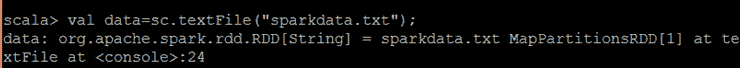

# 什么是 RDD？

> 原文：<https://www.javatpoint.com/apache-spark-rdd>

RDD(弹性分布式数据集)是 Spark 的核心抽象。它是元素的集合，跨集群的节点进行划分，以便我们可以对其执行各种并行操作。

创建关系数据库有两种方法:

*   并行化驱动程序中的现有数据
*   引用外部存储系统中的数据集，如共享文件系统、HDFS、HBase 或任何提供 Hadoop 输入格式的数据源。

## 并行集合

要创建并行化集合，在驱动程序中的现有集合上调用 **SparkContext 的**并行化方法。集合中的每个元素都被复制以形成可并行操作的分布式数据集。

```

val info = Array(1, 2, 3, 4)
val distinfo = sc.parallelize(info)

```

现在，我们可以并行操作分布式数据集(distinfo)，比如 distinfo.reduce((a，b) => a + b)。

## 外部数据集

在 Spark 中，分布式数据集可以从 Hadoop 支持的任何类型的存储源创建，例如 HDFS、Cassandra、HBase，甚至我们的本地文件系统。Spark 支持文本文件、**序列文件**和其他类型的 Hadoop **输入格式**。

**SparkContext 的** textFile 方法可以用来创建 RDD 的文本文件。此方法对文件采用 URI(机器上的本地路径或 hdfs://)并读取文件的数据。



现在，我们可以通过数据集操作对数据进行操作，例如，我们可以使用地图将所有线的大小相加，并按如下方式减少操作:data.map(s => s.length)。减少((a，b) => a + b)。

* * *