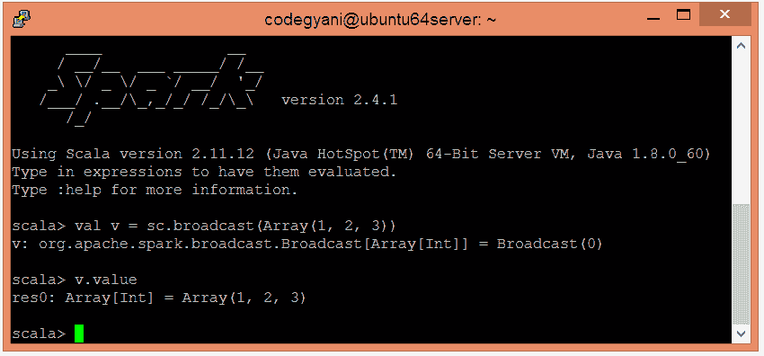

# RDD 共享变量

> 原文：<https://www.javatpoint.com/apache-spark-rdd-shared-variables>

在 Spark 中，当任何函数传递给转换操作时，它将在远程集群节点上执行。它在函数中使用的所有变量的不同副本上工作。这些变量被复制到每台机器上，并且对远程机器上的变量的任何更新都不会恢复到驱动程序。

## 广播变量

广播变量支持缓存在每台机器上的只读变量，而不是提供任务的副本。Spark 使用广播算法来分配广播变量，以降低通信成本。

火花动作的执行经过几个阶段，由分布式“洗牌”操作分开。Spark 自动广播每个阶段内任务所需的公共数据。以这种方式广播的数据以序列化形式缓存，并在运行每个任务之前反序列化。

要创建广播变量(比如 v)，请调用 SparkContext.broadcast(v)。让我们用一个例子来理解。

```

scala> val v = sc.broadcast(Array(1, 2, 3))
scala> v.value

```



## 蓄电池

累加器是用于执行关联和交换操作的变量，如计数器或和。Spark 支持数字类型的累加器。但是，我们可以添加对新类型的支持。

若要创建数字累加器，请调用 sparkcontext . Long 累加器()或 sparkcontext . Double 累加器()来累加 Long 或 Double 类型的值。

```

scala> val a=sc.longAccumulator("Accumulator")
scala> sc.parallelize(Array(2,5)).foreach(x=>a.add(x))
scala> a.value

```


* * *