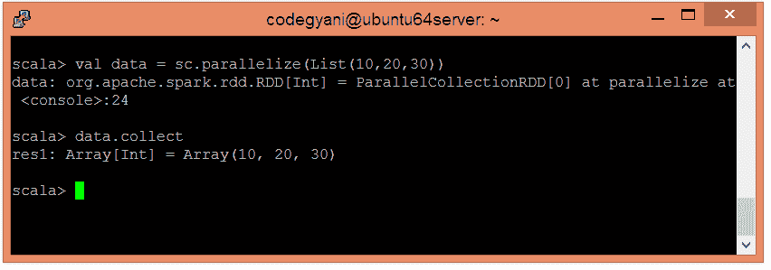
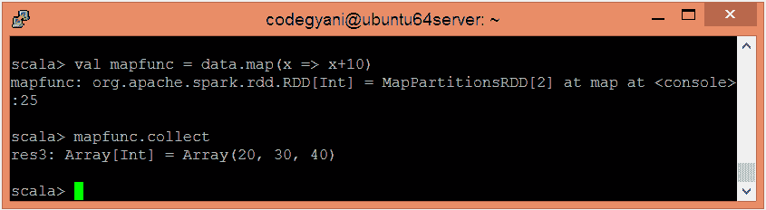

# Spark映射函数

> 原文：<https://www.javatpoint.com/apache-spark-map-function>

在 Spark 中，Map 通过函数传递源的每个元素，并形成一个新的分布式数据集。

### 地图功能示例

在这个例子中，我们给每个元素添加一个常量值 10。

*   要在 Scala 模式下打开Spark，请执行以下命令

```

$ spark-shell

```


*   使用并行集合创建 RDD。

```

scala> val data = sc.parallelize(List(10,20,30))

```

*   现在，我们可以使用以下命令读取生成的结果。

```

scala> data.collect

```



*   应用 map 函数并传递执行所需的表达式。

```

scala> val mapfunc = data.map(x => x+10)

```

*   现在，我们可以使用以下命令读取生成的结果。

```

scala> mapfunc.collect

```



在这里，我们得到了期望的输出。

* * *